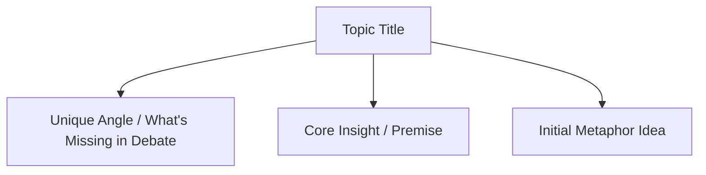

# Topic Brainstorm Skill

This skill conducts focused, high-energy brainstorming sessions to capture raw ideas, explore what makes Chris's perspective unique, and generate initial **topic stubs** in `topics/documents/` ready for future elaboration.

---

## 🎯 Core Purpose

1. **Uncover Latent Insights**: Help Chris articulate ideas he's been pondering, frustrations with current practices, or hard-won wisdom.
2. **Elicit the "Unique Addition"**: Use focused grill-me questioning to uncover: *What is missing from the existing public discussion that Chris can uniquely add?*
3. **Generate Actionable Topic Stubs**: Quickly produce structured Obsidian-ready markdown stubs in `topics/documents/` linked to `topics/themes/` so great ideas are never lost.
4. **Partner with `trend-research`**: Ingest trending news, Reddit debates, or Substack essays to spark and anchor new brainstorming angles.

---

## 🧭 The Brainstorming Workflow

```text
[ 1. Trigger / Discovery ]
      ├── Ingest trend signals from `trend-research` OR explore organic ideas from Chris
      ▼
[ 2. The Focused "Grill-Me" Interview ]
      ├── "What's the core observation or itch you want to scratch?"
      ├── "What does the industry or community get wrong about this?"
      ├── "What unique perspective, scar tissue, or alternative do you offer?"
      ▼
[ 3. Initial Angle Synthesis ]
      ├── Refine 1-2 sentence core thesis
      ├── Identify 1 preliminary metaphor or relatable example
      ├── Tag relevant themes (e.g. javascript, architecture, leadership)
      ▼
[ 4. Stub Generation & Vault Registration ]
      ├── Create initial stub in `topics/documents/<slug>.md`
      ├── Cross-link into `topics/themes/<theme>.md` & `topics/themes.md`
      └── Auto-commit & push to GitHub
```

---

## 🎤 The Brainstorming "Grill-Me" Protocol

Unlike the deep-dive grill-me (which stress-tests counter-arguments and steel-mans the opposition), the **brainstorming grill-me** is designed for **ideation excavation and novelty extraction**:

### 1. The Novelty Check
- *"If you search Google or YouTube for this right now, what is everyone saying, and why does their advice fall short?"*
- *"What is the counter-intuitive twist in how you approach this problem?"*

### 2. The Authority / Experience Check
- *"Where did you first learn this lesson the hard way? Was there a specific project or moment?"*
- *"Is this something you find yourself repeatedly explaining to teammates, mentees, or clients?"*

### 3. The Hook / Curiosity Angle
- *"If you had 15 seconds to grab the attention of an engineer or leader on this, what surprising statement would you start with?"*

---

## 📝 Topic Stub Format

When a brainstormed idea is ready to capture as a stub, create `topics/documents/<slug>.md` with initial YAML properties and scaffolding:

```markdown
---
id: TOP-XXX
title: "Topic Title"
pillar: "Pillar Name"
status: idea
created: 2026-09-17
tags:
  - theme-tag1
  - theme-tag2
themes:
  - "[[topics/themes/theme-name|Theme Name]]"
aliases:
  - "Topic Title"
---

# Topic Title

## 🗺️ Topic Mind Map (Initial)



---

## 1. Core Angle & What We're Adding
- **The Itch / Observation**: [What sparked this topic]
- **The Consensus Gap**: [What everyone else says vs what's actually true]
- **Chris's Unique Value**: [The fresh perspective, scar tissue, or systems-level insight]

---

## 2. Preliminary Ideas & Seeds
- **Initial Metaphor**: [Candidate physical/relatable analogy]
- **Story Seed**: [Brief note on the project or life event behind this]
- **Key Takeaway**: [1-sentence lesson]

---

## 3. Next Steps (Handoff to Topic Deep-Dive)
- Run `topic-deep-dive` to steel-man counter-arguments, flesh out multi-channel hooks, and build publication matrix.
```

---

## 🔄 Integration with Other Skills

| Scenario | Workflow |
| :--- | :--- |
| **"I want to write about something trending"** | `trend-research` (finds debates) ➔ `topic-brainstorm` (excavates Chris's angle) ➔ creates stub. |
| **"I have an idea about X, help me brainstorm it"** | `topic-brainstorm` (grill-me on novelty & angle) ➔ creates stub. |
| **"Let's flesh this stub out completely"** | `topic-deep-dive` (fleshes out stories, devil's advocate, hooks, and release plan). |
