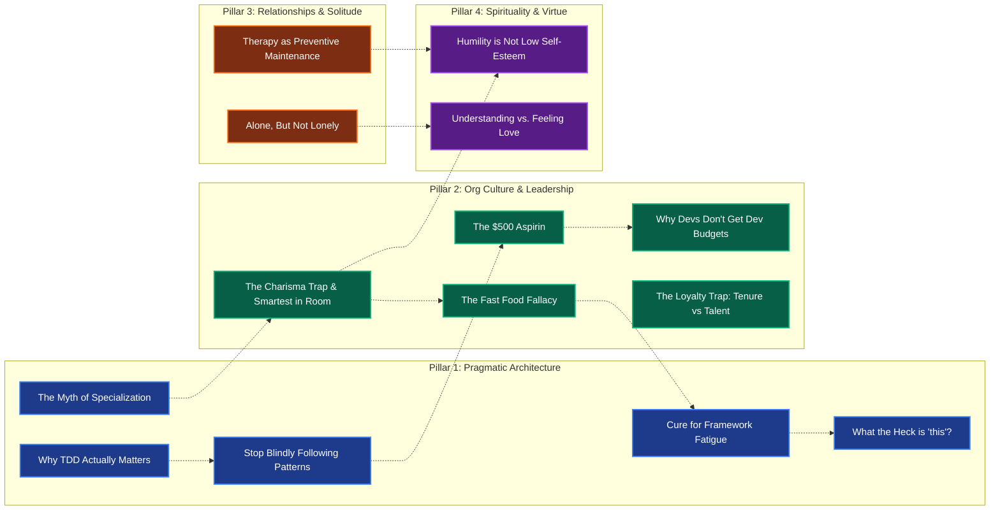

# Content Ecosystem & Mind Map Index

Welcome to the central graph for social media ideas, long-form essays, and multi-platform media strategy.

---

## 🗺️ Master Mind Map Graph

---

## 📂 Topic Registry & Dedicated Mind Maps

| ID | Topic Title | Pillar | Dedicated Mind Map & Outlines | Target Channels |
| :--- | :--- | :--- | :--- | :--- |
| `TOP-001` | **The $500 Aspirin** | Org Culture | [the-500-dollar-aspirin.md](topics/the-500-dollar-aspirin.md) | Medium, BlueSky, YouTube |
| `TOP-002` | **What the Heck is "this"?** | Pragmatic Architecture | [what-the-heck-is-this.md](topics/what-the-heck-is-this.md) | Medium, BlueSky, YouTube |
| `TOP-003` | **Alone, But Not Lonely** | Relationships | [alone-but-not-lonely.md](topics/alone-but-not-lonely.md) | Medium, YouTube, BlueSky |
| `TOP-004` | **Humility is Not Low Self-Esteem** | Spirituality & Virtue | [humility-is-not-low-self-esteem.md](topics/humility-is-not-low-self-esteem.md) | Medium, BlueSky, YouTube |
| `TOP-005` | **Cure for Framework Fatigue** | Pragmatic Architecture | [cure-for-framework-fatigue.md](topics/cure-for-framework-fatigue.md) | Medium, BlueSky, YouTube |
| `TOP-006` | **The Fast Food Fallacy** | Org Culture | [the-fast-food-fallacy.md](topics/the-fast-food-fallacy.md) | Medium, BlueSky, Shorts |
| `TOP-007` | **Why TDD Actually Matters** | Pragmatic Architecture | [why-tdd-matters.md](topics/why-tdd-matters.md) | Medium, BlueSky, YouTube |
| `TOP-008` | **The Loyalty Trap** | Org Culture | [the-loyalty-trap.md](topics/the-loyalty-trap.md) | Medium, BlueSky, Shorts |
| `TOP-009` | **The Charisma Trap & Smartest in Room** | Org Culture | [the-charisma-trap.md](topics/the-charisma-trap.md) | Medium, BlueSky, YouTube |
| `TOP-010` | **Therapy as Preventive Maintenance** | Relationships | [therapy-preventive-maintenance.md](topics/therapy-preventive-maintenance.md) | Medium, BlueSky, YouTube |
| `TOP-011` | **Understanding vs. Feeling Love** | Spirituality & Virtue | [understanding-vs-feeling-love.md](topics/understanding-vs-feeling-love.md) | Medium, BlueSky, YouTube |
| `TOP-012` | **Stop Blindly Following Patterns** | Pragmatic Architecture | [stop-blindly-following-patterns.md](topics/stop-blindly-following-patterns.md) | Medium, BlueSky, YouTube |
| `TOP-013` | **Why Devs Don't Get Dev Budgets** | Org Culture | [why-devs-dont-get-budgets.md](topics/why-devs-dont-get-budgets.md) | Medium, BlueSky, Shorts |
| `TOP-014` | **The Myth of Specialization** | Pragmatic Architecture | [the-myth-of-specialization.md](topics/the-myth-of-specialization.md) | Medium, BlueSky, YouTube |

---

## 🏷️ Keyword & Tag Index

- `#Adaptability`: `TOP-014`
- `#AI`: `TOP-005`, `TOP-006`, `TOP-014`
- `#Architecture`: `TOP-002`, `TOP-005`, `TOP-007`, `TOP-012`, `TOP-014`
- `#CareerWisdom`: `TOP-001`, `TOP-006`, `TOP-008`, `TOP-009`, `TOP-014`
- `#Consulting`: `TOP-001`, `TOP-013`
- `#EmotionalMaturity`: `TOP-003`, `TOP-004`, `TOP-010`, `TOP-011`
- `#EngineeringLeadership`: `TOP-001`, `TOP-008`, `TOP-009`, `TOP-013`
- `#Introversion`: `TOP-003`, `TOP-009`, `TOP-010`
- `#JavaScript`: `TOP-002`, `TOP-005`
- `#MentalHealth`: `TOP-003`, `TOP-010`
- `#Pragmatism`: `TOP-002`, `TOP-005`, `TOP-007`, `TOP-012`, `TOP-014`
- `#Relationships`: `TOP-003`, `TOP-010`, `TOP-011`
- `#Spirituality`: `TOP-004`, `TOP-011`
- `#Storytelling`: `TOP-004`, `TOP-011`
- `#TDD`: `TOP-007`
