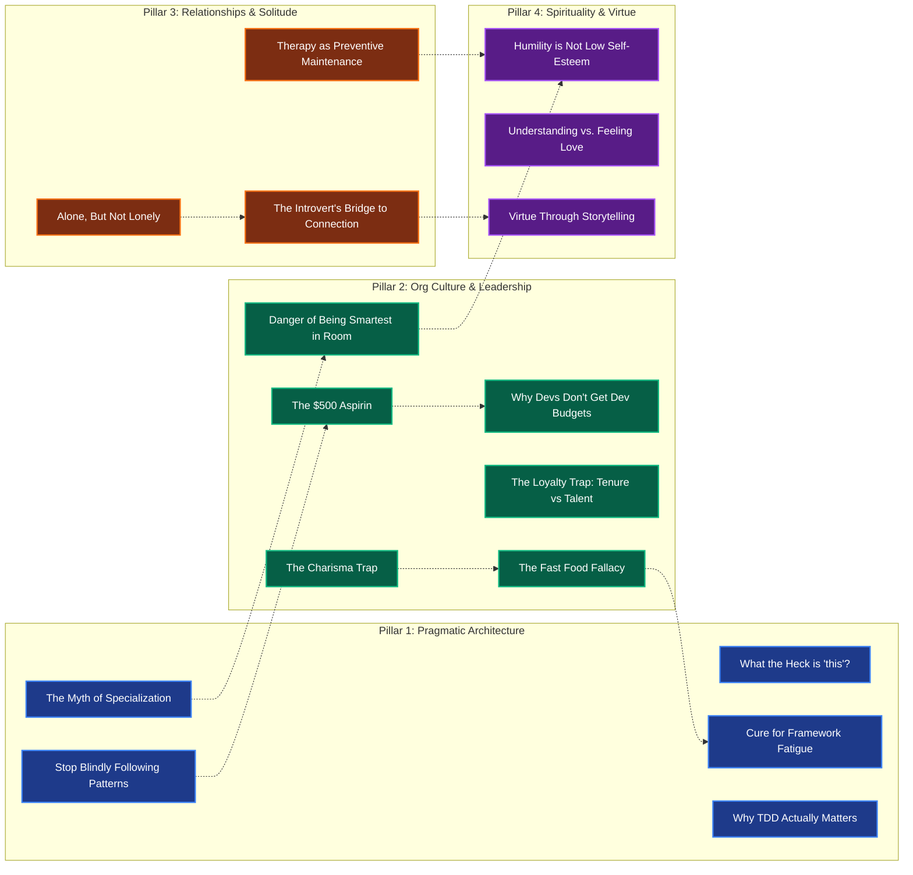

# Content Ecosystem & Mind Map Index

Welcome to the central graph for social media ideas, long-form essays, and multi-platform media strategy.

---

## 🗺️ Master Mind Map Graph

---

## 📂 Topic Registry

| ID | Topic Title | Pillar | Status | Channels |
| :--- | :--- | :--- | :--- | :--- |
| `TOP-001` | [The $500 Aspirin](topics/the-500-dollar-aspirin.md) | Org Culture | Idea | Medium, BlueSky, YouTube |
| `TOP-002` | [What the Heck is "this"?](topics/what-the-heck-is-this.md) | Pragmatic Architecture | Idea | Medium, BlueSky |
| `TOP-003` | [Alone, But Not Lonely](topics/alone-but-not-lonely.md) | Relationships | Idea | Medium, YouTube, BlueSky |
| `TOP-004` | [Humility is Not Low Self-Esteem](topics/humility-is-not-low-self-esteem.md) | Spirituality & Virtue | Idea | Medium, BlueSky, Video |
| `TOP-005` | [Cure for Framework Fatigue](topics/cure-for-framework-fatigue.md) | Pragmatic Architecture | Idea | Medium, BlueSky |
| `TOP-006` | [The Fast Food Fallacy](topics/the-fast-food-fallacy.md) | Org Culture | Idea | Medium, BlueSky, Short-form |
| `TOP-007` | [Why TDD Actually Matters](topics/why-tdd-matters.md) | Pragmatic Architecture | Idea | Medium, BlueSky, Video |
| `TOP-008` | [The Loyalty Trap](topics/the-loyalty-trap.md) | Org Culture | Idea | Medium, BlueSky |
| `TOP-009` | [The Charisma Trap & Smartest in Room](topics/the-charisma-trap.md) | Org Culture | Idea | Medium, BlueSky |
| `TOP-010` | [Therapy as Preventive Maintenance](topics/therapy-preventive-maintenance.md) | Relationships | Idea | Medium, BlueSky |
| `TOP-011` | [Understanding vs Feeling Love](topics/understanding-vs-feeling-love.md) | Spirituality & Virtue | Idea | Medium, BlueSky |
| `TOP-012` | [Stop Blindly Following Patterns](topics/stop-blindly-following-patterns.md) | Pragmatic Architecture | Idea | Medium, BlueSky |
| `TOP-013` | [Why Dev Teams Don't Get Budgets](topics/why-devs-dont-get-budgets.md) | Org Culture | Idea | Medium, BlueSky |

---

## 🏷️ Keyword & Tag Index

- `#Architecture`: `TOP-002`, `TOP-005`, `TOP-012`
- `#CareerWisdom`: `TOP-001`, `TOP-006`, `TOP-008`, `TOP-009`
- `#Consulting`: `TOP-001`, `TOP-013`
- `#EmotionalHealth`: `TOP-003`, `TOP-010`, `TOP-011`
- `#EngineeringLeadership`: `TOP-001`, `TOP-008`, `TOP-009`, `TOP-013`
- `#Introversion`: `TOP-003`
- `#JavaScript`: `TOP-002`, `TOP-005`
- `#Mentorship`: `TOP-004`, `TOP-009`, `TOP-012`
- `#Pragmatism`: `TOP-002`, `TOP-005`, `TOP-007`, `TOP-012`
- `#Spirituality`: `TOP-004`, `TOP-011`
- `#TDD`: `TOP-007`
