# Alone, But Not Lonely: The Spectrum of Solitude and Connection

## Metadata
- **ID**: `TOP-003`
- **Pillar**: Pillar 3: Relationships & Solitude
- **Status**: Outlined
- **Primary Keywords**: #Solitude #Introversion #Relationships #Loneliness #EmotionalMaturity #Connection
- **Related Topics**: [[topics/the-introverts-bridge.md|The Introvert's Bridge to Connection]], [[topics/understanding-vs-feeling-love.md|Understanding vs Feeling Love]], [[topics/therapy-preventive-maintenance.md|Therapy as Preventive Maintenance]]
- **Target Channels**: Medium (Anchor Essay), BlueSky (Reflection / Discussion), YouTube (Talking-Head Video Essay)

---

## 🗺️ Topic Mind Map

```mermaid
graph TD
    ALONE["Alone, But Not Lonely"]

    %% Branches
    ALONE --> QUADRANT["1. The Solitude/Loneliness Quadrant"]
    ALONE --> MYTH["2. The Extrovert Bias & Cultural Myths"]
    ALONE --> TRANSITION["3. The Bridge: Alone & Lonely ➔ Not Alone & Not Lonely"]
    ALONE --> NUANCE["4. Vulnerability & Counter-Perspectives"]
    ALONE --> REPURPOSE["5. Multi-Platform Storytelling"]

    %% Quadrant
    QUADRANT --> Q1["Alone & Lonely (Isolation/Despair)"]
    QUADRANT --> Q2["Not Alone & Lonely (Crowded Alienation)"]
    QUADRANT --> Q3["Alone & Not Lonely (Peaceful Solitude)"]
    QUADRANT --> Q4["Not Alone & Not Lonely (Deep Authentic Connection)"]

    %% Myths
    MYTH --> SOCIETAL["Society equating physical solitude with social failure"]
    MYTH --> INTROVERT_REALITY["Introverts gain energy in solitude, but still need genuine depth"]

    %% Transition
    TRANSITION --> INTELLECTUAL_BARRIER["Over-analyzing people vs experiencing connection"]
    TRANSITION --> SMALL_STEPS["Finding low-friction, high-authenticity interaction"]

    %% Nuance
    NUANCE --> COMFORT_TRAP["The risk of comfortable isolation becoming a bunker"]
    NUANCE --> HUNGER["Acknowledging the honest human desire for companionship"]

    %% Repurposing
    REPURPOSE --> MED["Medium: Vulnerable Personal Essay"]
    REPURPOSE --> BS["BlueSky: Engaging Reflection Thread"]
    REPURPOSE --> YT["YouTube: Introspective Video Essay"]
```

---

## 1. Core Thesis & Nuance

### The Core Premise
Being physically alone is an objective physical state; being lonely is a subjective emotional vacuum. Millions of people live in crowded rooms, toxic relationships, or active offices and feel crushing loneliness. Conversely, peaceful solitude is rich and nourishing. Yet, while being "alone but not lonely" is far healthier than being "surrounded and lonely," the true ultimate aspiration is moving into the fourth quadrant: being **not alone and not lonely**—connected in authentic, mutual intimacy without sacrificing one's inner peace.

### The Counter-Perspective & Nuance
1. **The Safety Trap of Solitude**: It is easy for intelligent, self-sufficient introverts to use "I'm peaceful alone" as a fortress against the vulnerability and messiness of real relationships.
2. **The Inherent Friction of People**: Other humans are unpredictable, demanding, and imperfect. Choosing connection requires accepting inevitable friction.
3. **The Crowded Loneliness Trap**: Acknowledging that simply "getting out more" or attending shallow social events often amplifies loneliness rather than curing it.

### Blind Spots & Nuances
- Acknowledging my own introverted baseline: What feels like restorative solitude to me might feel like excruciating isolation to an extrovert.
- Moving from the head (analyzing relationships) to the heart (experiencing them).

---

## 2. Evidence & Story Bank

### Personal Anecdotes
- Experiences of feeling completely serene alone on a weekend vs. the hollow exhaustion of being at a crowded networking event.
- The conscious realization that solitude is a haven, but isolation can become a cage if not balanced with intentional connection.

### Metaphors & Analogies
- **The Empty Cup vs. The Deep Well**: Loneliness is sitting beside a dry cup waiting for someone to pour water into it. Solitude is drinking from your own well. True companionship is when two people with full wells sit together and share the water.

---

## 3. Multi-Channel Repurposing Matrix

### Medium (Anchor Essay)
- **Title**: *Alone, But Not Lonely: Why the Crowded Room is Often the Loneliest Place on Earth*
- **Sections**:
  1. The Great Misconception: Solitude vs. Loneliness.
  2. The Four Quadrants of Human Connection.
  3. The Introvert’s Dilemma: The Comfort of the Fortress.
  4. The Next Horizon: How to Seek "Not Alone and Not Lonely" Without Losing Yourself.

### BlueSky / Micro-Post
- **Hook**: "There are two kinds of solitude: the kind that starves you, and the kind that feeds you. And there's a third state most people are terrified to admit: feeling completely alone while surrounded by people. 🧵"

### YouTube Video Essay
- Visual: Quiet, atmospheric setting, breaking down the 4 quadrants on a simple graphic, speaking candidly to camera about the introvert's journey.

---

## 4. Interactive Discussion Prompt
> *"Have you ever felt more lonely in a crowded room with friends or family than you have when you were completely by yourself? What made the difference?"*
