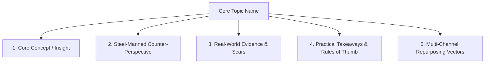

# Document Vault Template

## Metadata
- **ID**: `DOC-000`
- **Pillar**: [Pillar 1: Pragmatic Architecture | Pillar 2: Org Culture & Leadership | Pillar 3: Relationships & Solitude | Pillar 4: Spirituality & Virtue]
- **Status**: [Idea | In-Research | Outlined | Drafted | Published]
- **Primary Themes**: [[topics/themes/theme-name.md|Theme Name]]
- **Keywords**: #keyword1 #keyword2 #keyword3
- **Related Documents**: [[topics/documents/related-doc.md|Related Document]]
- **Target Channels**: Medium, Substack, BlueSky, YouTube, TikTok
- **Social Derivatives**:
  - Medium: `topics/social/medium/doc-name.md`
  - BlueSky: `topics/social/bluesky/doc-name.md`
  - YouTube: `topics/social/youtube/doc-name.md`
  - Substack: `topics/social/substack/doc-name.md`
  - TikTok: `topics/social/tiktok/doc-name.md`

---

## 🗺️ Topic Mind Map

---

## 1. Deep-Dive Knowledge & Context
- **Core Insight**: Comprehensive thesis, foundational principles, and why this matters.
- **Counter-Perspective (Steel-Manning)**: Legitimate arguments against this viewpoint; context where the opposite is true.
- **Nuances & Blind Spots**: Boundary conditions, edge cases, and personal experience biases.

---

## 2. Evidence, Stories & Reference Vault
- **Personal Anecdotes & Field Experience**: Detailed career stories, project retrospectives, hard-won lessons.
- **Data, Books & Academic/Industry Citations**: External studies, whitepapers, notable figures.
- **Media & Visual Assets**: Links to diagrams (`topics/media/diagrams/`), charts, or screenshots.

---

## 3. Multi-Channel Derivative Mapping
- **Medium / Substack (Long-Form Essay)**: Narrative arc, deep exploration, thesis-antithesis-synthesis.
- **BlueSky (Micro & Threads)**: Punchy counter-intuitive insights, key takeaway hooks.
- **YouTube (Long-Form Video)**: Structured visual presentation, live code/architecture walkthrough.
- **Short-Form Video (Shorts / TikTok)**: 60-second high-energy hook, 1 metaphor, 1 actionable takeaway.
