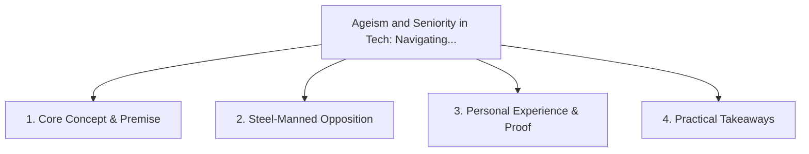

# Ageism and Seniority in Tech: Navigating the 2026 Labor Market with 20+ Years Experience

<!-- prettier-ignore-start -->
<!-- markdownlint-disable MD013 -->
**Series Context**: Part 3 of the [[topics/documents/series-the-broken-tech-hiring-market|The Broken Tech Hiring Market & Standing Out in 2026]] series.
<!-- markdownlint-restore -->
<!-- prettier-ignore-end -->

---

## 🗺️ Topic Mind Map

---

## 1. Deep-Dive Knowledge & Context

### Core Insight

Senior engineers face unspoken age and salary biases; reframing 20 years of experience as
high-leverage risk reduction is the winning pivot.

### Counter-Perspective (Steel-Manning)

Early-career engineers often have lower salary expectations and adapt quickly to raw grinding hours.

### Nuances & Blind Spots

- Practical implementation edge cases when adopting this approach in production environments.
- Distinguishing between dogmatic application and context-sensitive pragmatism.

---

## 2. Evidence, Stories & Reference Vault

### Personal Anecdotes & Field Experience

- Interviewing for roles where the entire interview panel had less combined tenure than my time
  writing production code.

### Metaphors & Analogies

- **A master ship captain being judged on how fast they can tie one specific knot.**

---

## 3. Practical Action & Takeaways

1. **First Step**: Audit existing workflows or codebases for this specific failure mode or pattern.
2. **Rule of Thumb**: Prefer explicit, decoupled, and durable implementations over transient
   convenience.
3. **Core Metric**: Reduced maintenance friction, lower cognitive load, and sustained velocity.

---

## 4. Multi-Channel Repurposing Matrix

### Medium / Substack (Focused Deep Dive)

- Narrative arc exploring the problem, field scar tissue, counter-arguments, and solution.

### BlueSky (Micro & Thread Hook)

- **Hook**: "A counter-intuitive lesson from 20+ years of engineering: Senior engineers face
  unspoken age and salary biases; reframing 20 years of experience as high-leverage risk reduction
  i... 🧵"

### YouTube / TikTok (Short & Video Vector)

- **Hook**: 60-second walkthrough centered on the metaphor: _A master ship captain being judged on
  how fast they can tie one specific knot._.
