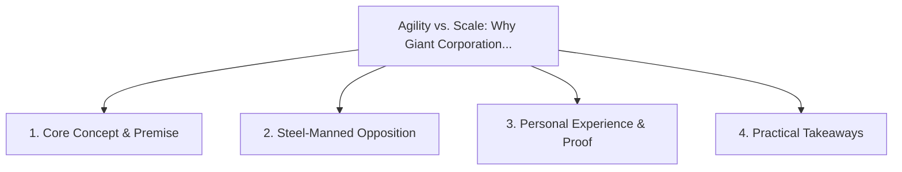

# Agility vs. Scale: Why Giant Corporations Cannot Pivot to Niche Demand

<!-- prettier-ignore-start -->
<!-- markdownlint-disable MD013 -->
**Series Context**: Part 4 of the [[topics/documents/series-post-mass-production-economy|The Post-Mass Production Economy & Local Precision]] series.
<!-- markdownlint-restore -->
<!-- prettier-ignore-end -->

---

## 🗺️ Topic Mind Map

---

## 1. Deep-Dive Knowledge & Context

### Core Insight

Corporate overhead and multi-layer management create institutional inertia, leaving hyper-custom
niche markets completely unguarded.

### Counter-Perspective (Steel-Manning)

Large corporations have massive balance sheets to acquire nimble startups the moment a niche
matures.

### Nuances & Blind Spots

- Practical implementation edge cases when adopting this approach in production environments.
- Distinguishing between dogmatic application and context-sensitive pragmatism.

---

## 2. Evidence, Stories & Reference Vault

### Personal Anecdotes & Field Experience

- Watching a Fortune 500 company spend $2M evaluating a product update that a 2-person team shipped
  over a weekend.

### Metaphors & Analogies

- **A blue whale unable to chase schools of nimble fish darting into shallow coral reefs.**

---

## 3. Practical Action & Takeaways

1. **First Step**: Audit existing workflows or codebases for this specific failure mode or pattern.
2. **Rule of Thumb**: Prefer explicit, decoupled, and durable implementations over transient
   convenience.
3. **Core Metric**: Reduced maintenance friction, lower cognitive load, and sustained velocity.

---

## 4. Multi-Channel Repurposing Matrix

### Medium / Substack (Focused Deep Dive)

- Narrative arc exploring the problem, field scar tissue, counter-arguments, and solution.

### BlueSky (Micro & Thread Hook)

- **Hook**: "A counter-intuitive lesson from 20+ years of engineering: Corporate overhead and
  multi-layer management create institutional inertia, leaving hyper-custom niche markets
  completel... 🧵"

### YouTube / TikTok (Short & Video Vector)

- **Hook**: 60-second walkthrough centered on the metaphor: _A blue whale unable to chase schools of
  nimble fish darting into shallow coral reefs._.
