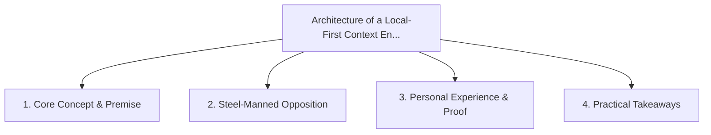

# Architecture of a Local-First Context Engine: Privacy, Integration, and AI

<!-- prettier-ignore-start -->
<!-- markdownlint-disable MD013 -->
**Series Context**: Part 6 of the [[topics/documents/series-the-context-aware-time-tracker|The Context-Aware Time Tracker & Anti-Nag Productivity]] series.
<!-- markdownlint-restore -->
<!-- prettier-ignore-end -->

---

## 🗺️ Topic Mind Map

---

## 1. Deep-Dive Knowledge & Context

### Core Insight

A personal context orchestrator must be local-first, storing sensitive calendar and task data in
SQLite while executing lightweight local AI heuristics.

### Counter-Perspective (Steel-Manning)

Cloud-hosted SaaS solutions offer effortless cross-device sync between iPhone, Android, and web.

### Nuances & Blind Spots

- Practical implementation edge cases when adopting this approach in production environments.
- Distinguishing between dogmatic application and context-sensitive pragmatism.

---

## 2. Evidence, Stories & Reference Vault

### Personal Anecdotes & Field Experience

- Designing an offline-first SQLite synchronization engine for personal calendar and task streams.

### Metaphors & Analogies

- **A personal leather journal kept in your desk drawer rather than on a public bulletin board.**

---

## 3. Practical Action & Takeaways

1. **First Step**: Audit existing workflows or codebases for this specific failure mode or pattern.
2. **Rule of Thumb**: Prefer explicit, decoupled, and durable implementations over transient
   convenience.
3. **Core Metric**: Reduced maintenance friction, lower cognitive load, and sustained velocity.

---

## 4. Multi-Channel Repurposing Matrix

### Medium / Substack (Focused Deep Dive)

- Narrative arc exploring the problem, field scar tissue, counter-arguments, and solution.

### BlueSky (Micro & Thread Hook)

- **Hook**: "A counter-intuitive lesson from 20+ years of engineering: A personal context
  orchestrator must be local-first, storing sensitive calendar and task data in SQLite while
  executing ... 🧵"

### YouTube / TikTok (Short & Video Vector)

- **Hook**: 60-second walkthrough centered on the metaphor: _A personal leather journal kept in your
  desk drawer rather than on a public bulletin board._.
