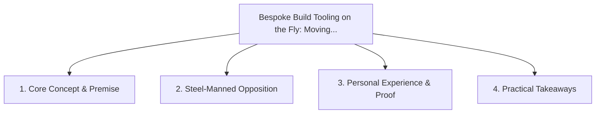

# Bespoke Build Tooling on the Fly: Moving Beyond Monolithic Bundlers

<!-- prettier-ignore-start -->
<!-- markdownlint-disable MD013 -->
**Series Context**: Part 6 of the [[topics/documents/series-the-zero-dependency-web|The Zero-Dependency & Zero-Framework Web]] series.
<!-- markdownlint-restore -->
<!-- prettier-ignore-end -->

---

## 🗺️ Topic Mind Map

---

## 1. Deep-Dive Knowledge & Context

### Core Insight

Ephemeral, AI-generated build scripts tailored precisely to a project eliminate the need for
complex, opaque bundler configurations.

### Counter-Perspective (Steel-Manning)

Webpack/Vite have enormous plugin ecosystems for edge-case asset transformations.

### Nuances & Blind Spots

- Practical implementation edge cases when adopting this approach in production environments.
- Distinguishing between dogmatic application and context-sensitive pragmatism.

---

## 2. Evidence, Stories & Reference Vault

### Personal Anecdotes & Field Experience

- Spending 3 days debugging Vite/Rollup config issues for a basic static asset pipeline.

### Metaphors & Analogies

- **3D printing a custom socket wrench for one bolt instead of hauling a 500-pound toolbox.**

---

## 3. Practical Action & Takeaways

1. **First Step**: Audit existing workflows or codebases for this specific failure mode or pattern.
2. **Rule of Thumb**: Prefer explicit, decoupled, and durable implementations over transient
   convenience.
3. **Core Metric**: Reduced maintenance friction, lower cognitive load, and sustained velocity.

---

## 4. Multi-Channel Repurposing Matrix

### Medium / Substack (Focused Deep Dive)

- Narrative arc exploring the problem, field scar tissue, counter-arguments, and solution.

### BlueSky (Micro & Thread Hook)

- **Hook**: "A counter-intuitive lesson from 20+ years of engineering: Ephemeral, AI-generated build
  scripts tailored precisely to a project eliminate the need for complex, opaque bundler con... 🧵"

### YouTube / TikTok (Short & Video Vector)

- **Hook**: 60-second walkthrough centered on the metaphor: _3D printing a custom socket wrench for
  one bolt instead of hauling a 500-pound toolbox._.
