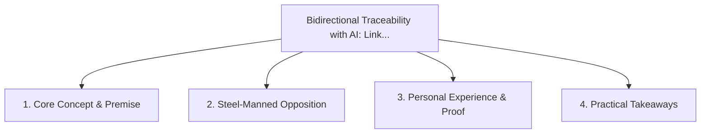

# Bidirectional Traceability with AI: Linking Every Test to Business Intent

<!-- prettier-ignore-start -->
<!-- markdownlint-disable MD013 -->
**Series Context**: Part 2 of the [[topics/documents/series-living-requirements-ai-traceability|Living Requirements & End-to-End AI Traceability]] series.
<!-- markdownlint-restore -->
<!-- prettier-ignore-end -->

---

## 🗺️ Topic Mind Map

---

## 1. Deep-Dive Knowledge & Context

### Core Insight

AI agents can maintain real-time bidirectional links between user stories, unit test assertions, and
production functions automatically.

### Counter-Perspective (Steel-Manning)

Heavy traceability matrices were the bane of waterfall systems engineering.

### Nuances & Blind Spots

- Practical implementation edge cases when adopting this approach in production environments.
- Distinguishing between dogmatic application and context-sensitive pragmatism.

---

## 2. Evidence, Stories & Reference Vault

### Personal Anecdotes & Field Experience

- Automating compliance audits by querying an AI graph connecting HIPAA rules directly to unit
  tests.

### Metaphors & Analogies

- **An interactive digital blueprint where clicking any brick shows the exact municipal zoning
  permit.**

---

## 3. Practical Action & Takeaways

1. **First Step**: Audit existing workflows or codebases for this specific failure mode or pattern.
2. **Rule of Thumb**: Prefer explicit, decoupled, and durable implementations over transient
   convenience.
3. **Core Metric**: Reduced maintenance friction, lower cognitive load, and sustained velocity.

---

## 4. Multi-Channel Repurposing Matrix

### Medium / Substack (Focused Deep Dive)

- Narrative arc exploring the problem, field scar tissue, counter-arguments, and solution.

### BlueSky (Micro & Thread Hook)

- **Hook**: "A counter-intuitive lesson from 20+ years of engineering: AI agents can maintain
  real-time bidirectional links between user stories, unit test assertions, and production
  function... 🧵"

### YouTube / TikTok (Short & Video Vector)

- **Hook**: 60-second walkthrough centered on the metaphor: _An interactive digital blueprint where
  clicking any brick shows the exact municipal zoning permit._.
