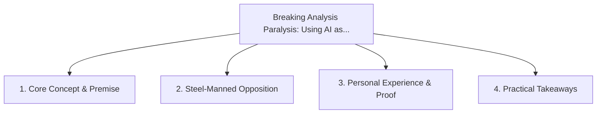

# Breaking Analysis Paralysis: Using AI as a Low-Stakes Sparring Partner

<!-- prettier-ignore-start -->
<!-- markdownlint-disable MD013 -->
**Series Context**: Part 4 of the [[topics/documents/series-neurodiversity-and-systems-thinking|Neurodiversity, ADHD & Systems Thinking in Tech]] series.
<!-- markdownlint-restore -->
<!-- prettier-ignore-end -->

---

## 🗺️ Topic Mind Map

---

## 1. Deep-Dive Knowledge & Context

### Core Insight

ADHD task initiation friction disappears when you can talk through messy thoughts with an AI
sparring partner without fear of judgment.

### Counter-Perspective (Steel-Manning)

Endless conversational exploration with AI can become a sophisticated form of productive
procrastination.

### Nuances & Blind Spots

- Practical implementation edge cases when adopting this approach in production environments.
- Distinguishing between dogmatic application and context-sensitive pragmatism.

---

## 2. Evidence, Stories & Reference Vault

### Personal Anecdotes & Field Experience

- Unblocking a 3-week creative stall in 15 minutes by rambling into a voice recorder paired with an
  LLM summarizer.

### Metaphors & Analogies

- **Priming a manual water pump with a cup of water to start the gushing flow.**

---

## 3. Practical Action & Takeaways

1. **First Step**: Audit existing workflows or codebases for this specific failure mode or pattern.
2. **Rule of Thumb**: Prefer explicit, decoupled, and durable implementations over transient
   convenience.
3. **Core Metric**: Reduced maintenance friction, lower cognitive load, and sustained velocity.

---

## 4. Multi-Channel Repurposing Matrix

### Medium / Substack (Focused Deep Dive)

- Narrative arc exploring the problem, field scar tissue, counter-arguments, and solution.

### BlueSky (Micro & Thread Hook)

- **Hook**: "A counter-intuitive lesson from 20+ years of engineering: ADHD task initiation friction
  disappears when you can talk through messy thoughts with an AI sparring partner without fe... 🧵"

### YouTube / TikTok (Short & Video Vector)

- **Hook**: 60-second walkthrough centered on the metaphor: _Priming a manual water pump with a cup
  of water to start the gushing flow._.
