# Breaking the Iron Triangle: Practical Automation and the Triple-Win Formula

## 🗺️ Topic Mind Map

```mermaid
graph TD
    TRIANGLE["Breaking the Iron Triangle"]

    %% Main Branches
    TRIANGLE --> MYTH["1. The Iron Triangle Myth"]
    TRIANGLE --> STORY["2. The Mail-Merge Breakthrough"]
    TRIANGLE --> TRIPLE_WIN["3. The Triple-Win Reality"]
    TRIANGLE --> EMPOWER["4. Personal Empowerment & Agency"]
    TRIANGLE --> STEELMAN["5. Counter-Perspective & Nuance"]
    TRIANGLE --> DISTRIBUTION["6. Multi-Channel Distribution"]

    %% Sub-nodes
    MYTH --> PICK_TWO["Orthodoxy: Good, Fast, Cheap — pick two"]
    MYTH --> RESIGNATION["Acceptance of friction, waste, and manual grind"]

    STORY --> DRUDGERY["Filling paper forms by hand + photocopying"]
    STORY --> SPREADSHEET["Single data row in a spreadsheet"]
    STORY --> MACROS["Automated form fills, clean letters, auto emails, synced databases"]

    TRIPLE_WIN --> TIME["Time: Zero re-entry, instant print vs photocopy"]
    TRIPLE_WIN --> QUALITY["Quality: Typeface vs handwriting, zero typo propagation"]
    TRIPLE_WIN --> COST["Cost: Initial setup repaid immediately, compounding ROI"]

    EMPOWER --> DESIRE["Give people what they already want (time, ease, quality)"]
    EMPOWER --> NO_LECTURES["Don't lecture people into wanting something different"]
    EMPOWER --> DEMOCRATIZATION["Everyday automation tools (AI, scripts, local macros)"]

    STEELMAN --> OVERENGINEER["Risk: Spending 20 hours automating a 5-minute one-off task"]
    STEELMAN --> MAINTENANCE_COST["Risk: Brittle automations breaking silently"]

    DISTRIBUTION --> LINKEDIN["LinkedIn / Substack: The Leadership & Efficiency Essay"]
    DISTRIBUTION --> BLUESKY["BlueSky / X: Contrarian 'Iron Triangle is a Lie' Thread"]
    DISTRIBUTION --> MEDIUM["Medium: Detailed Tactical Guide on Micro-Automations"]
```

---

## 🎯 Core Thesis & Premise

Project management orthodoxy teaches that you can never have quality, speed, and
low cost at the same time—that every efficiency gain is a compromise. **This
"Iron Triangle" is a myth when applied to redundant manual processes.**

When you eliminate friction through thoughtful, focused micro-automation, you
don't compromise: you achieve **all three simultaneously**. The goal of modern
automation (and AI) shouldn't be to sell complex enterprise platforms or lecture
people about changing their habits; it must be to give people what they *already
desire*—relief from drudgery, pristine output, and reclaimed personal time.

---

## 📖 The Grounded Narrative (Chris's Story)

- **The Drudgery:** Early in his career, Chris faced a daily administrative
  gauntlet: manually filling out stacks of paper forms by hand, then walking
  them to the copier to duplicate. The process was slow, error-prone, physically
  tiring, and limited by handwriting legibility.
- **The Intervention:** Instead of accepting the status quo or lobbying for an
  enterprise IT overhaul, Chris consolidated the data into a single row of a
  spreadsheet and built merge macros.
- **The Transformation:**
  - One data entry generated cleanly formatted official letters (replacing
    underlined forms with seamless professional documents).
  - Automatically populated downstream databases and sent required emails to
    other divisions without duplicate data entry.
  - Printing an extra crisp copy on demand was faster, cleaner, and cheaper than
    making physical photocopies.
- **The Outcome:** The initial time invested to create the macros was recouped
  almost immediately. Work quality spiked, turnaround time plummeted, and ongoing
  operating cost dropped to near zero.

---

## ⚖️ The Triple-Win Framework

| Dimension | Standard Manual Process | The Automated Reality (Triple-Win) |
| :--- | :--- | :--- |
| **Speed (Fast)** | Hours spent on repetitive entry, filing, copying, and mailing. | Instant generation and batch execution in seconds. |
| **Quality (Good)** | Inconsistent handwriting, transcription typos, clumsy form underlines. | Pixel-perfect typographic layout, validated data, zero transcription errors. |
| **Cost (Cheap)** | Ongoing labor expense, copier supplies, maintenance, error correction. | Fixed micro-investment upfront with compounding indefinite ROI. |

---

## 🛡️ Steel-Manning & Counter-Perspectives

1. **The Over-Automation Fallacy:** XKCD-style trap where people spend weeks
   building an elaborate system to automate a task they do once a year.
   - *Resolution:* Focus strictly on high-frequency, high-friction, error-multiplying bottlenecks.
2. **Brittle Tooling & Maintenance Overhead:** Hardcoded macros or fragile API
   hooks that fail when downstream formats change.
   - *Resolution:* Build lightweight, transparent, local-first scripts and clear data models.

---

## 🚀 Hooks & Angles

- **The Contrarian Angle:** *"Everyone tells you to pick two: Fast, Cheap, or Good.
  Here is why that advice is keeping your team drowning in busywork."*
- **The Relatable Story Angle:** *"Years ago, I spent hours every day writing
  names on paper forms by hand. One spreadsheet row killed the entire workflow
  and made our output look 10x more professional."*
- **The Practical Philosophy Angle:** *"Stop trying to convince people to change
  what they want. Give them the leverage to do what they already want to do in
  half the time."*

---

## 🔗 Related Documents & Themes

- [[topics/documents/cure-for-framework-fatigue|Cure for Framework Fatigue]]
- [[topics/documents/why-smaller-codebases-win|Why Smaller Codebases Win]]
- [[topics/documents/the-anti-nag-philosophy|The Anti-Nag Philosophy]]
- [[topics/documents/working-memory-offloading-with-ai|Working Memory Offloading with AI]]
