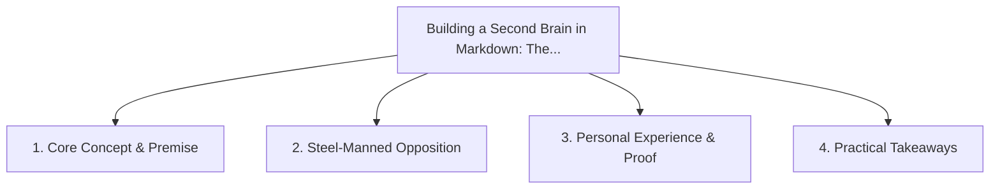

# Building a Second Brain in Markdown: The Non-Linear Knowledge Vault

<!-- prettier-ignore-start -->
<!-- markdownlint-disable MD013 -->
**Series Context**: Part 7 of the [[topics/documents/series-neurodiversity-and-systems-thinking|Neurodiversity, ADHD & Systems Thinking in Tech]] series.
<!-- markdownlint-restore -->
<!-- prettier-ignore-end -->

---

## 🗺️ Topic Mind Map

---

## 1. Deep-Dive Knowledge & Context

### Core Insight

Bi-directional markdown linking in Obsidian matches the associative, non-linear indexing of ADHD
thinking far better than hierarchical folders.

### Counter-Perspective (Steel-Manning)

Building and tweaking the knowledge vault can become a hobby that replaces actual writing and
output.

### Nuances & Blind Spots

- Practical implementation edge cases when adopting this approach in production environments.
- Distinguishing between dogmatic application and context-sensitive pragmatism.

---

## 2. Evidence, Stories & Reference Vault

### Personal Anecdotes & Field Experience

- Organizing 15 years of scattered engineering notes into a unified semantic Obsidian vault.

### Metaphors & Analogies

- **Trading a rigid filing cabinet for an interconnected celestial constellation.**

---

## 3. Practical Action & Takeaways

1. **First Step**: Audit existing workflows or codebases for this specific failure mode or pattern.
2. **Rule of Thumb**: Prefer explicit, decoupled, and durable implementations over transient
   convenience.
3. **Core Metric**: Reduced maintenance friction, lower cognitive load, and sustained velocity.

---

## 4. Multi-Channel Repurposing Matrix

### Medium / Substack (Focused Deep Dive)

- Narrative arc exploring the problem, field scar tissue, counter-arguments, and solution.

### BlueSky (Micro & Thread Hook)

- **Hook**: "A counter-intuitive lesson from 20+ years of engineering: Bi-directional markdown
  linking in Obsidian matches the associative, non-linear indexing of ADHD thinking far better
  tha... 🧵"

### YouTube / TikTok (Short & Video Vector)

- **Hook**: 60-second walkthrough centered on the metaphor: _Trading a rigid filing cabinet for an
  interconnected celestial constellation._.
