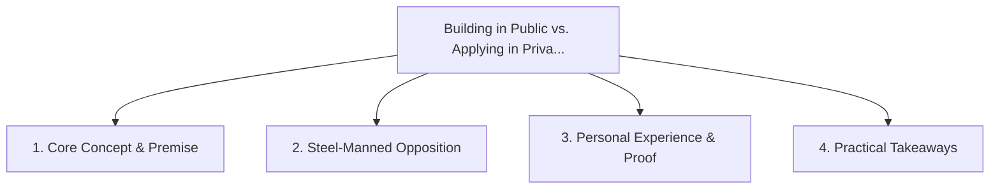

# Building in Public vs. Applying in Private: Creating an Un-Fakeable Trail of Competence

<!-- prettier-ignore-start -->
<!-- markdownlint-disable MD013 -->
**Series Context**: Part 4 of the [[topics/documents/series-the-broken-tech-hiring-market|The Broken Tech Hiring Market & Standing Out in 2026]] series.
<!-- markdownlint-restore -->
<!-- prettier-ignore-end -->

---

## 🗺️ Topic Mind Map

---

## 1. Deep-Dive Knowledge & Context

### Core Insight

Publishing open-source code, essays, and architectural breakdowns creates permanent inbound career
gravity that outshines any 2-page PDF.

### Counter-Perspective (Steel-Manning)

Building in public requires substantial unpaid emotional energy and vulnerability.

### Nuances & Blind Spots

- Practical implementation edge cases when adopting this approach in production environments.
- Distinguishing between dogmatic application and context-sensitive pragmatism.

---

## 2. Evidence, Stories & Reference Vault

### Personal Anecdotes & Field Experience

- Receiving direct advisory consulting offers from an open-source architectural post while cold job
  applications languished.

### Metaphors & Analogies

- **Lighting a beacon on a hilltop instead of knocking on locked dungeon doors.**

---

## 3. Practical Action & Takeaways

1. **First Step**: Audit existing workflows or codebases for this specific failure mode or pattern.
2. **Rule of Thumb**: Prefer explicit, decoupled, and durable implementations over transient
   convenience.
3. **Core Metric**: Reduced maintenance friction, lower cognitive load, and sustained velocity.

---

## 4. Multi-Channel Repurposing Matrix

### Medium / Substack (Focused Deep Dive)

- Narrative arc exploring the problem, field scar tissue, counter-arguments, and solution.

### BlueSky (Micro & Thread Hook)

- **Hook**: "A counter-intuitive lesson from 20+ years of engineering: Publishing open-source code,
  essays, and architectural breakdowns creates permanent inbound career gravity that outshine... 🧵"

### YouTube / TikTok (Short & Video Vector)

- **Hook**: 60-second walkthrough centered on the metaphor: _Lighting a beacon on a hilltop instead
  of knocking on locked dungeon doors._.
