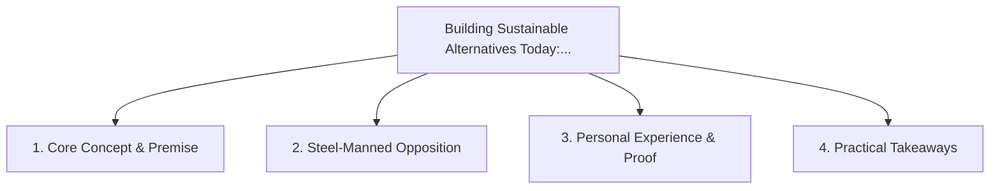

# Building Sustainable Alternatives Today: Operating Outside the Extractive Playbook

<!-- prettier-ignore-start -->
<!-- markdownlint-disable MD013 -->
**Series Context**: Part 7 of the [[topics/documents/series-the-evolution-beyond-extractive-capitalism|The Evolution Beyond Extractive Capitalism & The Myth of Self-Interest]] series.
<!-- markdownlint-restore -->
<!-- prettier-ignore-end -->

---

## 🗺️ Topic Mind Map

---

## 1. Deep-Dive Knowledge & Context

### Core Insight

Engineers and creators do not have to wait for global policy; we can build worker co-ops,
open-source cooperatives, and fair-exchange networks right now.

### Counter-Perspective (Steel-Manning)

Bootstrapping non-extractive businesses without venture capital requires immense personal patience
and resilience.

### Nuances & Blind Spots

- Practical implementation edge cases when adopting this approach in production environments.
- Distinguishing between dogmatic application and context-sensitive pragmatism.

---

## 2. Evidence, Stories & Reference Vault

### Personal Anecdotes & Field Experience

- Choosing to structure projects around open collaboration and transparent value distribution.

### Metaphors & Analogies

- **Planting fruit trees whose shade and harvest will outlive the current quarter.**

---

## 3. Practical Action & Takeaways

1. **First Step**: Audit existing workflows or codebases for this specific failure mode or pattern.
2. **Rule of Thumb**: Prefer explicit, decoupled, and durable implementations over transient
   convenience.
3. **Core Metric**: Reduced maintenance friction, lower cognitive load, and sustained velocity.

---

## 4. Multi-Channel Repurposing Matrix

### Medium / Substack (Focused Deep Dive)

- Narrative arc exploring the problem, field scar tissue, counter-arguments, and solution.

### BlueSky (Micro & Thread Hook)

- **Hook**: "A counter-intuitive lesson from 20+ years of engineering: Engineers and creators do not
  have to wait for global policy; we can build worker co-ops, open-source cooperatives, and ... 🧵"

### YouTube / TikTok (Short & Video Vector)

- **Hook**: 60-second walkthrough centered on the metaphor: _Planting fruit trees whose shade and
  harvest will outlive the current quarter._.
