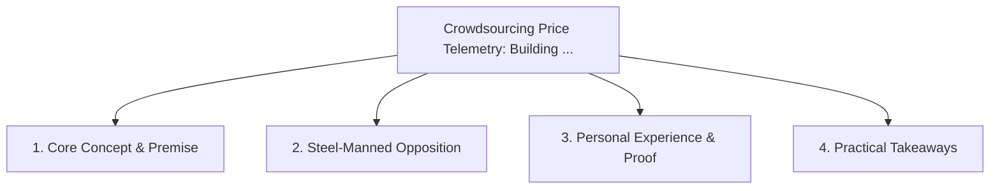

# Crowdsourcing Price Telemetry: Building the Distributed Consumer Watchdog

<!-- prettier-ignore-start -->
<!-- markdownlint-disable MD013 -->
**Series Context**: Part 2 of the [[topics/documents/series-the-anti-surveillance-consumer|The Anti-Surveillance Consumer & Algorithmic Transparency]] series.
<!-- markdownlint-restore -->
<!-- prettier-ignore-end -->

---

## 🗺️ Topic Mind Map

---

## 1. Deep-Dive Knowledge & Context

### Core Insight

An open-source browser extension network can aggregate real-time price quotes anonymously to alert
shoppers when they are being price-gouged.

### Counter-Perspective (Steel-Manning)

Aggregator scraping is heavily rate-limited and bot-protected by major e-commerce platforms.

### Nuances & Blind Spots

- Practical implementation edge cases when adopting this approach in production environments.
- Distinguishing between dogmatic application and context-sensitive pragmatism.

---

## 2. Evidence, Stories & Reference Vault

### Personal Anecdotes & Field Experience

- Prototyping client-side price trackers that pool anonymized price observations across shoppers.

### Metaphors & Analogies

- **A neighborhood watch for online storefronts.**

---

## 3. Practical Action & Takeaways

1. **First Step**: Audit existing workflows or codebases for this specific failure mode or pattern.
2. **Rule of Thumb**: Prefer explicit, decoupled, and durable implementations over transient
   convenience.
3. **Core Metric**: Reduced maintenance friction, lower cognitive load, and sustained velocity.

---

## 4. Multi-Channel Repurposing Matrix

### Medium / Substack (Focused Deep Dive)

- Narrative arc exploring the problem, field scar tissue, counter-arguments, and solution.

### BlueSky (Micro & Thread Hook)

- **Hook**: "A counter-intuitive lesson from 20+ years of engineering: An open-source browser
  extension network can aggregate real-time price quotes anonymously to alert shoppers when they
  ar... 🧵"

### YouTube / TikTok (Short & Video Vector)

- **Hook**: 60-second walkthrough centered on the metaphor: _A neighborhood watch for online
  storefronts._.
