# Cure for Framework Fatigue: AI, Platform Standards, and Vanilla Code

## 🗺️ Topic Mind Map

```mermaid
graph TD
    FATIGUE["Cure for Framework Fatigue"]

    %% Branches
    FATIGUE --> PROBLEM["1. The Framework Treadmill"]
    FATIGUE --> AI_ROLE["2. The Real Role of AI"]
    FATIGUE --> METHOD["3. Platform Standards + AI Methodology"]
    FATIGUE --> STEELMAN["4. Counter-Perspective & Nuance"]
    FATIGUE --> REPURPOSE["5. Multi-Channel Distribution"]

    %% Problem
    PROBLEM --> CHURN["Framework churn every 2-3 years (Next, Remix, Astro, etc.)"]
    PROBLEM --> LOCKIN["Proprietary abstractions masquerading as standards"]
    PROBLEM --> MAINTENANCE["Massive refactors when meta-frameworks pivot"]

    %% AI Role
    AI_ROLE --> MISUSE["Current Misuse: AI generating bloated framework boilerplate"]
    AI_ROLE --> PROMISE["True Promise: AI as translator to Native Web Standards"]

    %% Method
    METHOD --> LOCAL_STANDARDS["Define strict local architectural rules/prompts"]
    METHOD --> VANILLA["Generate explicit, vanilla, platform-native code"]
    METHOD --> LONGEVITY["Zero-dependency or low-dependency long-term longevity"]

    %% Steelman
    STEELMAN --> TEAM_ONBOARDING["Frameworks provide uniform team conventions"]
    STEELMAN --> ECOSYSTEM["Rich ecosystem of pre-built UI components"]

    %% Repurpose
    REPURPOSE --> MED["Medium: Visionary Architecture Essay"]
    REPURPOSE --> BS["BlueSky: Contrarian Tech Take"]
    REPURPOSE --> YT["YouTube: Deep Architectural Breakdown"]
```

---

## 1. Core Thesis & Nuance

### The Core Premise
Frameworks were originally created because humans lacked the speed and consistency to hand-craft robust vanilla web applications with cross-browser compatibility, uniform conventions, and component models. However, frameworks introduced massive churn, lock-in, and maintenance fatigue. Now, AI can solve the problem frameworks were trying to solve—by adhering to strict local standards and generating explicit, vanilla, standards-based code directly for the target platform.

### The Counter-Perspective (Steel-Manning Frameworks)
1. **Shared Team Vocabulary**: When hiring, "Senior React Developer" provides an immediate shared mental model; "Vanilla JS with custom architectural conventions" requires onboarding.
2. **Ecosystem & Community Packages**: UI component libraries (headless UI, accessible primitives) are heavily built for the dominant frameworks.
3. **Complex Edge Cases**: Modern frameworks bundle battle-tested SSR, hydration, streaming, and asset optimization pipelines out of the box.

### Blind Spots & Nuances
- Building *without* a framework still requires a clear internal architecture—otherwise AI will produce inconsistent spaghetti.
- The need for strict "AI linting / agent rules" to enforce architectural consistency.

---

## 2. Evidence & Story Bank

### Personal Anecdotes
- Watching projects rewrite frontends 3 times over 10 years (Backbone -> Angular 1 -> React -> Next.js) while core business logic never changed.
- Building high-performance, maintainable systems using pure Web Standards and lightweight patterns that still run untouched years later.

### Metaphors & Analogies
- **The Construction Scaffolding**: Frameworks are like buying pre-fabricated rooms that dictate the shape of your entire house. AI + Web Standards is like having a master carpenter on demand who builds custom rooms that fit your exact foundation using standard lumber.

---

## 3. Multi-Channel Repurposing Matrix

### Medium (Anchor Essay)
- **Title**: *The Cure for Framework Fatigue: Why AI Makes Native Web Standards Win Again*
- **Sections**:
  1. The 15-Year Framework Pendulum.
  2. What Problem Were Frameworks Actually Solving?
  3. The New Paradigm: Local Standards + AI as the Concrete Implementer.
  4. How to Write Code That Will Still Run in 2036.

### BlueSky (Thread)
- **Hook**: "Every 3 years, tech promises a new framework to solve the complexity created by the last framework. Here's why AI might finally end the cycle—by bringing us back to Vanilla: 🧵"

---

## 4. Interactive Discussion Prompt
> *"If you could freeze your team's tech stack for the next 10 years with zero framework upgrades, what layer would you choose to build on?"*
