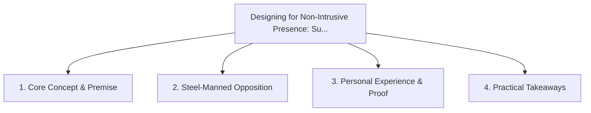

# Designing for Non-Intrusive Presence: Surfacing Information at Natural Transition Moments

<!-- prettier-ignore-start -->
<!-- markdownlint-disable MD013 -->
**Series Context**: Part 3 of the [[topics/documents/series-the-context-aware-time-tracker|The Context-Aware Time Tracker & Anti-Nag Productivity]] series.
<!-- markdownlint-restore -->
<!-- prettier-ignore-end -->

---

## 🗺️ Topic Mind Map

---

## 1. Deep-Dive Knowledge & Context

### Core Insight

Ambient UI and transition-moment detection allow tools to present critical deadlines without jarring
the user out of a flow state.

### Counter-Perspective (Steel-Manning)

Urgent emergency escalations require immediate disruptive sensory interruption.

### Nuances & Blind Spots

- Practical implementation edge cases when adopting this approach in production environments.
- Distinguishing between dogmatic application and context-sensitive pragmatism.

---

## 2. Evidence, Stories & Reference Vault

### Personal Anecdotes & Field Experience

- Designing an ambient status tray that changes color subtly as meetings approach instead of firing
  popup modals.

### Metaphors & Analogies

- **A sunset gradually darkening the room rather than someone flicking the overhead lights off
  instantly.**

---

## 3. Practical Action & Takeaways

1. **First Step**: Audit existing workflows or codebases for this specific failure mode or pattern.
2. **Rule of Thumb**: Prefer explicit, decoupled, and durable implementations over transient
   convenience.
3. **Core Metric**: Reduced maintenance friction, lower cognitive load, and sustained velocity.

---

## 4. Multi-Channel Repurposing Matrix

### Medium / Substack (Focused Deep Dive)

- Narrative arc exploring the problem, field scar tissue, counter-arguments, and solution.

### BlueSky (Micro & Thread Hook)

- **Hook**: "A counter-intuitive lesson from 20+ years of engineering: Ambient UI and
  transition-moment detection allow tools to present critical deadlines without jarring the user out
  of a f... 🧵"

### YouTube / TikTok (Short & Video Vector)

- **Hook**: 60-second walkthrough centered on the metaphor: _A sunset gradually darkening the room
  rather than someone flicking the overhead lights off instantly._.
