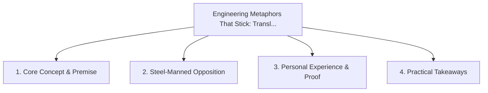

# Engineering Metaphors That Stick: Translating Abstract Tech into Tactile Concepts

<!-- prettier-ignore-start -->
<!-- markdownlint-disable MD013 -->
**Series Context**: Part 3 of the [[topics/documents/series-the-engineers-guide-to-storytelling|The Engineer’s Guide to Public Storytelling & Non-Captive Audiences]] series.
<!-- markdownlint-restore -->
<!-- prettier-ignore-end -->

---

## 🗺️ Topic Mind Map

---

## 1. Deep-Dive Knowledge & Context

### Core Insight

The human brain remembers physical, tactile metaphors 10x better than abstract system diagrams;
mastering analogy is an architect superpower.

### Counter-Perspective (Steel-Manning)

All metaphors break down at the edge cases if pushed too far.

### Nuances & Blind Spots

- Practical implementation edge cases when adopting this approach in production environments.
- Distinguishing between dogmatic application and context-sensitive pragmatism.

---

## 2. Evidence, Stories & Reference Vault

### Personal Anecdotes & Field Experience

- Explaining asynchronous event loops as a restaurant kitchen with a single chef and an order
  carousel.

### Metaphors & Analogies

- **Using a map of the city instead of a raw spreadsheet of GPS coordinates.**

---

## 3. Practical Action & Takeaways

1. **First Step**: Audit existing workflows or codebases for this specific failure mode or pattern.
2. **Rule of Thumb**: Prefer explicit, decoupled, and durable implementations over transient
   convenience.
3. **Core Metric**: Reduced maintenance friction, lower cognitive load, and sustained velocity.

---

## 4. Multi-Channel Repurposing Matrix

### Medium / Substack (Focused Deep Dive)

- Narrative arc exploring the problem, field scar tissue, counter-arguments, and solution.

### BlueSky (Micro & Thread Hook)

- **Hook**: "A counter-intuitive lesson from 20+ years of engineering: The human brain remembers
  physical, tactile metaphors 10x better than abstract system diagrams; mastering analogy is an ...
  🧵"

### YouTube / TikTok (Short & Video Vector)

- **Hook**: 60-second walkthrough centered on the metaphor: _Using a map of the city instead of a
  raw spreadsheet of GPS coordinates._.
