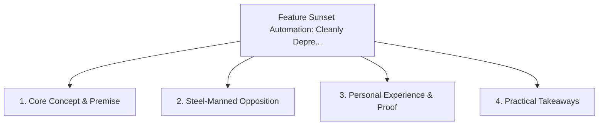

# Feature Sunset Automation: Cleanly Deprecating Features Across the Stack

<!-- prettier-ignore-start -->
<!-- markdownlint-disable MD013 -->
**Series Context**: Part 3 of the [[topics/documents/series-the-automated-code-pruner|The Automated Code Pruner & Dead Baggage Purge]] series.
<!-- markdownlint-restore -->
<!-- prettier-ignore-end -->

---

## 🗺️ Topic Mind Map

---

## 1. Deep-Dive Knowledge & Context

### Core Insight

Sunset should be an automated first-class pipeline that purges API endpoints, UI components,
database tables, and documentation in a single atomic PR.

### Counter-Perspective (Steel-Manning)

Gradual feature roll-downs with feature flags require multi-stage temporal deprecation phases.

### Nuances & Blind Spots

- Practical implementation edge cases when adopting this approach in production environments.
- Distinguishing between dogmatic application and context-sensitive pragmatism.

---

## 2. Evidence, Stories & Reference Vault

### Personal Anecdotes & Field Experience

- Executing a complete multi-tier feature sunset in one afternoon using AI-guided dependency
  tracing.

### Metaphors & Analogies

- **A surgical excision that closes all incisions cleanly without leaving foreign objects behind.**

---

## 3. Practical Action & Takeaways

1. **First Step**: Audit existing workflows or codebases for this specific failure mode or pattern.
2. **Rule of Thumb**: Prefer explicit, decoupled, and durable implementations over transient
   convenience.
3. **Core Metric**: Reduced maintenance friction, lower cognitive load, and sustained velocity.

---

## 4. Multi-Channel Repurposing Matrix

### Medium / Substack (Focused Deep Dive)

- Narrative arc exploring the problem, field scar tissue, counter-arguments, and solution.

### BlueSky (Micro & Thread Hook)

- **Hook**: "A counter-intuitive lesson from 20+ years of engineering: Sunset should be an automated
  first-class pipeline that purges API endpoints, UI components, database tables, and docume... 🧵"

### YouTube / TikTok (Short & Video Vector)

- **Hook**: 60-second walkthrough centered on the metaphor: _A surgical excision that closes all
  incisions cleanly without leaving foreign objects behind._.
