# Humility is Not Low Self-Esteem: The Strength of Self-Forgetfulness

## 🗺️ Topic Mind Map

```mermaid
graph TD
    HUMILITY["Humility is Not Low Self-Esteem"]

    %% Branches
    HUMILITY --> DEFINITION["1. Deconstructing the Term"]
    HUMILITY --> COMPARISON["2. The Self-Esteem Trap vs True Humility"]
    HUMILITY --> EMOTIONAL["3. Intellectual Knowledge vs Felt Virtue"]
    HUMILITY --> STEELMAN["4. Counter-Perspective & Nuance"]
    HUMILITY --> REPURPOSE["5. Multi-Channel Formats"]

    %% Definition
    DEFINITION --> MISCONCEPTION["Misconception: 'I am small, worthless, incapable'"]
    DEFINITION --> REALITY["True Definition: Freedom from the burden of constant self-obsession"]
    DEFINITION --> CS_LEWIS["C.S. Lewis: 'Humility is not thinking less of yourself, but thinking of yourself less'"]

    %% Comparison
    COMPARISON --> LOW_ESTEEM["Low Self-Esteem is STILL Self-Obsessed (Hyper-focused on my flaws)"]
    COMPARISON --> HIGH_ESTEEM["Fragile High Self-Esteem (Requires constant external validation)"]
    COMPARISON --> TRUE_HUMILITY["Humility = Quiet Competence & Spaciousness for Others"]

    %% Emotional
    EMOTIONAL --> BEYOND_LOGIC["Moving from intellectually categorizing virtue to feeling inner peace"]
    EMOTIONAL --> EMOTIONAL_STRENGTH["Humility as the foundation for true courage and forgiveness"]

    %% Steelman
    STEELMAN --> CULTURE_PRESSURE["Modern culture rewards self-promotion & aggressive branding"]
    STEELMAN --> RISK_DOORMAT["Fear of being treated as a doormat if one does not posture"]

    %% Repurpose
    REPURPOSE --> MED["Medium: Deep Philosophical Essay"]
    REPURPOSE --> BS["BlueSky: 4-Post Insight Thread"]
    REPURPOSE --> YT["YouTube Short: The Mirror Metaphor"]
```

---

## 1. Core Thesis & Nuance

### The Core Premise

Society constantly conflates humility with self-deprecation, weakness, or low self-esteem. In
reality, low self-esteem is just as self-absorbed as narcissism—both keep the spotlight intensely
trained on the "self" (one on its superiority, the other on its inadequacy). True humility is not
thinking poorly of yourself; it is the freedom of thinking of yourself less, allowing you to be
fully present, courageous, and capable of elevating others.

### The Counter-Perspective (Steel-Manning Self-Promotion)

1. **The Corporate / Social Media Reality**: In a hyper-competitive economy, self-promotion and loud
   confidence are frequently the primary filters for hiring, funding, and visibility.
2. **The "Doormat" Danger**: Without assertiveness, humble individuals can be exploited by toxic
   leaders or aggressive peers who mistake modesty for incompetence.
3. **Internal Calibration**: People recovering from trauma or imposter syndrome often need to
   actively build self-worth before they can practice healthy humility.

### Blind Spots & Nuances

- Distinguishing between _false modesty_ (fishing for compliments) and genuine humility.
- How to balance deep inner humility with necessary professional advocacy and leadership authority.

---

## 2. Evidence & Story Bank

### Personal Anecdotes

- Working alongside brilliant, unassuming engineers whose quiet confidence anchored entire systems
  without ever raising their voices or boasting.
- Personal struggles with trying to intellectualize virtues rather than letting them transform
  emotional reactions to criticism or slight.

### Metaphors & Analogies

- **The Clear Glass Window**: A dirty window draws all attention to itself (its smudges and
  scratches). A mirror reflects only yourself. A clean window is virtually invisible, letting the
  light and the beauty of the outside world pass through completely. Humility is the clean window.

---

## 3. Multi-Channel Repurposing Matrix

### Medium (Anchor Essay)

- **Title**: _Humility is Not Low Self-Esteem: The Liberating Power of Thinking of Yourself Less_
- **Sections**:
  1. The Cultural Confusion: Why We Treat Humility Like a Defect.
  2. The Self-Absorption Spectrum (Narcissism vs. Low Self-Esteem).
  3. The Quiet Power of Unshakable Competence.
  4. Moving from Knowing What Humility Is to Feeling It in Your Chest.

### BlueSky / Micro-Post

- **Hook**: "Low self-esteem is not humility. Both the narcissist and the person with low
  self-esteem share the exact same trap: they can't stop thinking about themselves. True humility is
  something entirely different: 🧵"

---

## 4. Interactive Discussion Prompt

> _"Who is someone in your life whose humility made you feel valued and respected, rather than
> small? What did they do differently?"_
