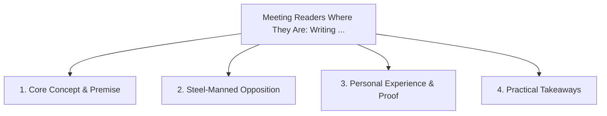

# Meeting Readers Where They Are: Writing Across Skill Levels Without Talking Down

<!-- prettier-ignore-start -->
<!-- markdownlint-disable MD013 -->
**Series Context**: Part 7 of the [[topics/documents/series-the-engineers-guide-to-storytelling|The Engineer’s Guide to Public Storytelling & Non-Captive Audiences]] series.
<!-- markdownlint-restore -->
<!-- prettier-ignore-end -->

---

## 🗺️ Topic Mind Map

---

## 1. Deep-Dive Knowledge & Context

### Core Insight

High-level communication respects the reader’s intelligence while removing unneeded prerequisites,
welcoming junior devs and leaders alike.

### Counter-Perspective (Steel-Manning)

Deeply specialized academic papers require precise domain-specific technical terminology.

### Nuances & Blind Spots

- Practical implementation edge cases when adopting this approach in production environments.
- Distinguishing between dogmatic application and context-sensitive pragmatism.

---

## 2. Evidence, Stories & Reference Vault

### Personal Anecdotes & Field Experience

- Refactoring an internal wiki to be accessible to product managers and seeing cross-team
  collaboration soar.

### Metaphors & Analogies

- **Building a wheelchair ramp that makes entering the building easier for everyone.**

---

## 3. Practical Action & Takeaways

1. **First Step**: Audit existing workflows or codebases for this specific failure mode or pattern.
2. **Rule of Thumb**: Prefer explicit, decoupled, and durable implementations over transient
   convenience.
3. **Core Metric**: Reduced maintenance friction, lower cognitive load, and sustained velocity.

---

## 4. Multi-Channel Repurposing Matrix

### Medium / Substack (Focused Deep Dive)

- Narrative arc exploring the problem, field scar tissue, counter-arguments, and solution.

### BlueSky (Micro & Thread Hook)

- **Hook**: "A counter-intuitive lesson from 20+ years of engineering: High-level communication
  respects the reader’s intelligence while removing unneeded prerequisites, welcoming junior devs...
  🧵"

### YouTube / TikTok (Short & Video Vector)

- **Hook**: 60-second walkthrough centered on the metaphor: _Building a wheelchair ramp that makes
  entering the building easier for everyone._.
