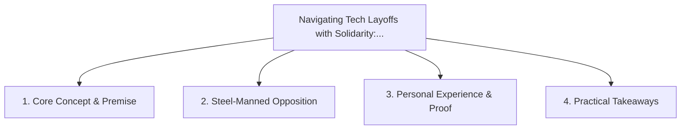

# Navigating Tech Layoffs with Solidarity: Empathy in Times of Corporate Contraction

<!-- prettier-ignore-start -->
<!-- markdownlint-disable MD013 -->
**Series Context**: Part 5 of the [[topics/documents/series-workplace-unity-and-consultation|Workplace Unity, Consultation & Blameless Culture]] series.
<!-- markdownlint-restore -->
<!-- prettier-ignore-end -->

---

## 🗺️ Topic Mind Map

---

## 1. Deep-Dive Knowledge & Context

### Core Insight

Layoffs reveal the true soul of a company; treating departing colleagues with dignity and supporting
their next chapter defines lasting culture.

### Counter-Perspective (Steel-Manning)

Remaining staff must rapidly regroup and stabilize core operations to keep the enterprise solvent.

### Nuances & Blind Spots

- Practical implementation edge cases when adopting this approach in production environments.
- Distinguishing between dogmatic application and context-sensitive pragmatism.

---

## 2. Evidence, Stories & Reference Vault

### Personal Anecdotes & Field Experience

- Mobilizing personal professional networks to place laid-off teammates into new roles within weeks.

### Metaphors & Analogies

- **Holding the safety line steady while climbers navigate an avalanche zone.**

---

## 3. Practical Action & Takeaways

1. **First Step**: Audit existing workflows or codebases for this specific failure mode or pattern.
2. **Rule of Thumb**: Prefer explicit, decoupled, and durable implementations over transient
   convenience.
3. **Core Metric**: Reduced maintenance friction, lower cognitive load, and sustained velocity.

---

## 4. Multi-Channel Repurposing Matrix

### Medium / Substack (Focused Deep Dive)

- Narrative arc exploring the problem, field scar tissue, counter-arguments, and solution.

### BlueSky (Micro & Thread Hook)

- **Hook**: "A counter-intuitive lesson from 20+ years of engineering: Layoffs reveal the true soul
  of a company; treating departing colleagues with dignity and supporting their next chapter ... 🧵"

### YouTube / TikTok (Short & Video Vector)

- **Hook**: 60-second walkthrough centered on the metaphor: _Holding the safety line steady while
  climbers navigate an avalanche zone._.
