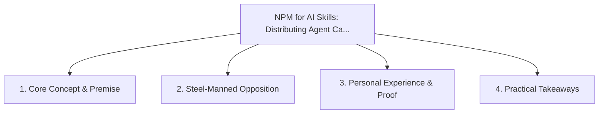

# NPM for AI Skills: Distributing Agent Capabilities Instead of Bloated Code

<!-- prettier-ignore-start -->
<!-- markdownlint-disable MD013 -->
**Series Context**: Part 4 of the [[topics/documents/series-the-zero-dependency-web|The Zero-Dependency & Zero-Framework Web]] series.
<!-- markdownlint-restore -->
<!-- prettier-ignore-end -->

---

## 🗺️ Topic Mind Map

---

## 1. Deep-Dive Knowledge & Context

### Core Insight

The future package manager will distribute composable agent rules, skills, and prompts rather than
compiled JavaScript binaries.

### Counter-Perspective (Steel-Manning)

Skill prompt drift and model non-determinism vs exact deterministic semver libraries.

### Nuances & Blind Spots

- Practical implementation edge cases when adopting this approach in production environments.
- Distinguishing between dogmatic application and context-sensitive pragmatism.

---

## 2. Evidence, Stories & Reference Vault

### Personal Anecdotes & Field Experience

- Packaging complex architectural guardrails into agent skill files instead of runtime middleware.

### Metaphors & Analogies

- **Handing a builder an architectural blueprint instead of shipping them pre-assembled dollhouse
  furniture.**

---

## 3. Practical Action & Takeaways

1. **First Step**: Audit existing workflows or codebases for this specific failure mode or pattern.
2. **Rule of Thumb**: Prefer explicit, decoupled, and durable implementations over transient
   convenience.
3. **Core Metric**: Reduced maintenance friction, lower cognitive load, and sustained velocity.

---

## 4. Multi-Channel Repurposing Matrix

### Medium / Substack (Focused Deep Dive)

- Narrative arc exploring the problem, field scar tissue, counter-arguments, and solution.

### BlueSky (Micro & Thread Hook)

- **Hook**: "A counter-intuitive lesson from 20+ years of engineering: The future package manager
  will distribute composable agent rules, skills, and prompts rather than compiled JavaScript b...
  🧵"

### YouTube / TikTok (Short & Video Vector)

- **Hook**: 60-second walkthrough centered on the metaphor: _Handing a builder an architectural
  blueprint instead of shipping them pre-assembled dollhouse furniture._.
