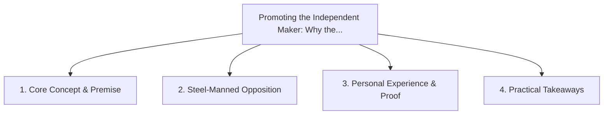

# Promoting the Independent Maker: Why the Future Belongs to Specialized Artisans

<!-- prettier-ignore-start -->
<!-- markdownlint-disable MD013 -->
**Series Context**: Part 3 of the [[topics/documents/series-post-mass-production-economy|The Post-Mass Production Economy & Local Precision]] series.
<!-- markdownlint-restore -->
<!-- prettier-ignore-end -->

---

## 🗺️ Topic Mind Map

---

## 1. Deep-Dive Knowledge & Context

### Core Insight

Modern CAD, AI design assistants, and digital fabrication empower solo artisans to compete directly
with global conglomerates on quality.

### Counter-Perspective (Steel-Manning)

Independent makers face massive distribution, marketing, and logistics headwinds compared to Amazon.

### Nuances & Blind Spots

- Practical implementation edge cases when adopting this approach in production environments.
- Distinguishing between dogmatic application and context-sensitive pragmatism.

---

## 2. Evidence, Stories & Reference Vault

### Personal Anecdotes & Field Experience

- Purchasing hand-crafted, high-durability tools from independent fabricators who stand behind their
  work.

### Metaphors & Analogies

- **The neighborhood blacksmith reborn with lasers and carbon-fiber composites.**

---

## 3. Practical Action & Takeaways

1. **First Step**: Audit existing workflows or codebases for this specific failure mode or pattern.
2. **Rule of Thumb**: Prefer explicit, decoupled, and durable implementations over transient
   convenience.
3. **Core Metric**: Reduced maintenance friction, lower cognitive load, and sustained velocity.

---

## 4. Multi-Channel Repurposing Matrix

### Medium / Substack (Focused Deep Dive)

- Narrative arc exploring the problem, field scar tissue, counter-arguments, and solution.

### BlueSky (Micro & Thread Hook)

- **Hook**: "A counter-intuitive lesson from 20+ years of engineering: Modern CAD, AI design
  assistants, and digital fabrication empower solo artisans to compete directly with global
  conglome... 🧵"

### YouTube / TikTok (Short & Video Vector)

- **Hook**: 60-second walkthrough centered on the metaphor: _The neighborhood blacksmith reborn with
  lasers and carbon-fiber composites._.
