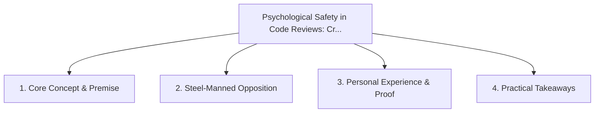

# Psychological Safety in Code Reviews: Critique the Code, Elevate the Person

<!-- prettier-ignore-start -->
<!-- markdownlint-disable MD013 -->
**Series Context**: Part 3 of the [[topics/documents/series-workplace-unity-and-consultation|Workplace Unity, Consultation & Blameless Culture]] series.
<!-- markdownlint-restore -->
<!-- prettier-ignore-end -->

---

## 🗺️ Topic Mind Map

---

## 1. Deep-Dive Knowledge & Context

### Core Insight

Code reviews should be celebratory mentorship rituals that build confidence, not gatekeeping
tribunals designed to prove superiority.

### Counter-Perspective (Steel-Manning)

Excessive politeness can sometimes lead to soft approvals on critical security or performance flaws.

### Nuances & Blind Spots

- Practical implementation edge cases when adopting this approach in production environments.
- Distinguishing between dogmatic application and context-sensitive pragmatism.

---

## 2. Evidence, Stories & Reference Vault

### Personal Anecdotes & Field Experience

- Instituting a review guide emphasizing curiosity questions ('What do you think about X?') over
  demands.

### Metaphors & Analogies

- **A master woodworker teaching an apprentice how to hold the chisel.**

---

## 3. Practical Action & Takeaways

1. **First Step**: Audit existing workflows or codebases for this specific failure mode or pattern.
2. **Rule of Thumb**: Prefer explicit, decoupled, and durable implementations over transient
   convenience.
3. **Core Metric**: Reduced maintenance friction, lower cognitive load, and sustained velocity.

---

## 4. Multi-Channel Repurposing Matrix

### Medium / Substack (Focused Deep Dive)

- Narrative arc exploring the problem, field scar tissue, counter-arguments, and solution.

### BlueSky (Micro & Thread Hook)

- **Hook**: "A counter-intuitive lesson from 20+ years of engineering: Code reviews should be
  celebratory mentorship rituals that build confidence, not gatekeeping tribunals designed to
  prove... 🧵"

### YouTube / TikTok (Short & Video Vector)

- **Hook**: 60-second walkthrough centered on the metaphor: _A master woodworker teaching an
  apprentice how to hold the chisel._.
