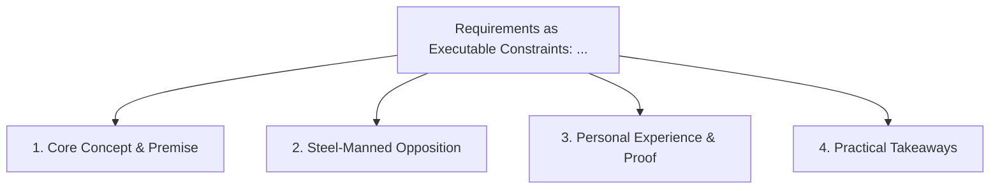

# Requirements as Executable Constraints: Turning PRDs into Agent Guardrails

<!-- prettier-ignore-start -->
<!-- markdownlint-disable MD013 -->
**Series Context**: Part 3 of the [[topics/documents/series-living-requirements-ai-traceability|Living Requirements & End-to-End AI Traceability]] series.
<!-- markdownlint-restore -->
<!-- prettier-ignore-end -->

---

## 🗺️ Topic Mind Map

---

## 1. Deep-Dive Knowledge & Context

### Core Insight

Static markdown PRDs should be parsed by AI directly into executable unit tests and agent
constraints before implementation begins.

### Counter-Perspective (Steel-Manning)

Expressing complex human UX nuances in formal executable specs is notoriously difficult.

### Nuances & Blind Spots

- Practical implementation edge cases when adopting this approach in production environments.
- Distinguishing between dogmatic application and context-sensitive pragmatism.

---

## 2. Evidence, Stories & Reference Vault

### Personal Anecdotes & Field Experience

- Using structured PRD acceptance tables to automatically seed end-to-end integration tests.

### Metaphors & Analogies

- **Programming the CNC machine directly from the CAD drawing.**

---

## 3. Practical Action & Takeaways

1. **First Step**: Audit existing workflows or codebases for this specific failure mode or pattern.
2. **Rule of Thumb**: Prefer explicit, decoupled, and durable implementations over transient
   convenience.
3. **Core Metric**: Reduced maintenance friction, lower cognitive load, and sustained velocity.

---

## 4. Multi-Channel Repurposing Matrix

### Medium / Substack (Focused Deep Dive)

- Narrative arc exploring the problem, field scar tissue, counter-arguments, and solution.

### BlueSky (Micro & Thread Hook)

- **Hook**: "A counter-intuitive lesson from 20+ years of engineering: Static markdown PRDs should
  be parsed by AI directly into executable unit tests and agent constraints before implementat...
  🧵"

### YouTube / TikTok (Short & Video Vector)

- **Hook**: 60-second walkthrough centered on the metaphor: _Programming the CNC machine directly
  from the CAD drawing._.
