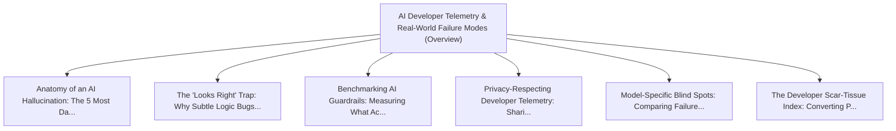

# Series: AI Developer Telemetry & Real-World Failure Modes

> **Series Scope**: This master document anchors the multi-part series on **AI Developer Telemetry &
> Real-World Failure Modes**. It outlines the overarching thesis, establishes the foundational
> principles, and cross-links all detailed sub-topic investigations below.

---

## 🗺️ Series Roadmap & Topic Graph

---

## 1. Master Thesis & Architecture

### The Core Premise

Aggregating real developer failure cases and error telemetry is the only reliable way to
systematically evaluate and harden AI coding agents.

### The Counter-Perspective (Steel-Manning Consensus)

Synthetic benchmarks (HumanEval, SWE-bench) provide standardized academic baselines.

### Nuances & Blind Spots

- Navigating the transition from legacy systems and habits to new models requires intentional
  scaffolding.
- Balancing forward-looking architectural ideals with immediate operational constraints.

---

## 2. Evidence, Stories & Analogies

### Personal Anecdotes & Field Experience

- Tracking the specific types of silent logic bugs LLMs introduce into complex state machines.

### Metaphors & Mental Models

- **Flight data black boxes for AI agent coding sessions.**

---

## 3. Series Reading Order & Topic Breakdowns

| Part   | Title & Link                                                                                                                                         | Key Focus / Takeaway                                                                          |
| :----- | :--------------------------------------------------------------------------------------------------------------------------------------------------- | :-------------------------------------------------------------------------------------------- |
| Part 1 | [[topics/documents/anatomy-of-ai-hallucinations-in-code   \| Anatomy of an AI Hallucination: The 5 Most Dangerous Code Generation Traps]]            | AI code errors are not random; they cluster around phantom library methods, shallow assump... |
| Part 2 | [[topics/documents/the-looks-right-trap                   \| The 'Looks Right' Trap: Why Subtle Logic Bugs Are 10x Worse Than Syntax Errors]]        | Compilers catch broken syntax instantly, but clean-looking AI code with flawed business lo... |
| Part 3 | [[topics/documents/benchmarking-ai-guardrails             \| Benchmarking AI Guardrails: Measuring What Actually Prevents Code Rot]]                 | Rigorous testing of skill files and prompt constraints reveals that short, deterministic r... |
| Part 4 | [[topics/documents/privacy-respecting-developer-telemetry \| Privacy-Respecting Developer Telemetry: Sharing Failure Data Safely]]                   | We can build IDE plugins that redact proprietary code while capturing abstracted prompt-to... |
| Part 5 | [[topics/documents/model-specific-blind-spots             \| Model-Specific Blind Spots: Comparing Failure Profiles Across Claude, Gemini, and GPT]] | Different LLM architectures exhibit distinct cognitive blind spots; routing tasks based on... |
| Part 6 | [[topics/documents/the-developer-scar-tissue-index        \| The Developer Scar-Tissue Index: Converting Production Bugs into Agent Skills]]         | Every post-mortem and production outage should produce an immutable agent rule or skill fi... |

---

## 4. Multi-Channel Repurposing Matrix

### Medium / Substack (Comprehensive Pillar Essay)

- **Title**: _Series: AI Developer Telemetry & Real-World Failure Modes_
- Narrative arc exploring the systemic forces, historical context, and tactical path forward.

### BlueSky (Anchor Launch Thread)

- **Hook**: "Most discussions about ai developer telemetry & real-world failure modes miss the root
  cause. Here is the breakdown of why this shift is inevitable and how to prepare: 🧵"

### YouTube / Podcast

- Long-form deep-dive breaking down the entire series roadmap with visual diagrams and architectural
  proofs.
