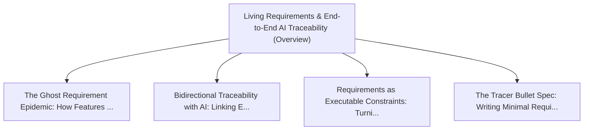

# Series: Living Requirements & End-to-End AI Traceability

> **Series Scope**: This master document anchors the multi-part series on **Living Requirements &
> End-to-End AI Traceability**. It outlines the overarching thesis, establishes the foundational
> principles, and cross-links all detailed sub-topic investigations below.

---

## 🗺️ Series Roadmap & Topic Graph

---

## 1. Master Thesis & Architecture

### The Core Premise

Bridging the fatal divide between business intent, PRDs, and production code using continuous
bidirectional AI requirements traceability.

### The Counter-Perspective (Steel-Manning Consensus)

Agile stories prioritize working software over comprehensive documentation.

### Nuances & Blind Spots

- Navigating the transition from legacy systems and habits to new models requires intentional
  scaffolding.
- Balancing forward-looking architectural ideals with immediate operational constraints.

---

## 2. Evidence, Stories & Analogies

### Personal Anecdotes & Field Experience

- Inheriting an enterprise codebase with 200 undocumented business rules hidden in obscure
  if-statements.

### Metaphors & Mental Models

- **A living neural network connecting executive vision directly to every line of committed code.**

---

## 3. Series Reading Order & Topic Breakdowns

| Part   | Title & Link                                                                                                                              | Key Focus / Takeaway                                                                          |
| :----- | :---------------------------------------------------------------------------------------------------------------------------------------- | :-------------------------------------------------------------------------------------------- |
| Part 1 | [[topics/documents/the-ghost-requirement-epidemic         \| The Ghost Requirement Epidemic: How Features Drift from Intent to PR]]       | Features inevitably drift across handoffs (Product -> Jira -> Design -> Code); without act... |
| Part 2 | [[topics/documents/bidirectional-traceability-with-ai     \| Bidirectional Traceability with AI: Linking Every Test to Business Intent]]  | AI agents can maintain real-time bidirectional links between user stories, unit test asser... |
| Part 3 | [[topics/documents/requirements-as-executable-constraints \| Requirements as Executable Constraints: Turning PRDs into Agent Guardrails]] | Static markdown PRDs should be parsed by AI directly into executable unit tests and agent ... |
| Part 4 | [[topics/documents/the-tracer-bullet-spec                 \| The Tracer Bullet Spec: Writing Minimal Requirements for AI Execution]]      | Writing thin, end-to-end vertical slice specifications allows AI agents to build and verif... |

---

## 4. Multi-Channel Repurposing Matrix

### Medium / Substack (Comprehensive Pillar Essay)

- **Title**: _Series: Living Requirements & End-to-End AI Traceability_
- Narrative arc exploring the systemic forces, historical context, and tactical path forward.

### BlueSky (Anchor Launch Thread)

- **Hook**: "Most discussions about living requirements & end-to-end ai traceability miss the root
  cause. Here is the breakdown of why this shift is inevitable and how to prepare: 🧵"

### YouTube / Podcast

- Long-form deep-dive breaking down the entire series roadmap with visual diagrams and architectural
  proofs.
