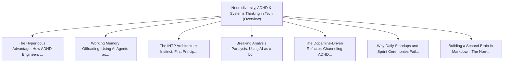

# Series: Neurodiversity, ADHD & Systems Thinking in Tech

> **Series Scope**: This master document anchors the multi-part series on **Neurodiversity, ADHD &
> Systems Thinking in Tech**. It outlines the overarching thesis, establishes the foundational
> principles, and cross-links all detailed sub-topic investigations below.

---

## 🗺️ Series Roadmap & Topic Graph

---

## 1. Master Thesis & Architecture

### The Core Premise

How ADHD and INTP cognitive wiring provide unique superpowers for complex systems architecture when
paired with external cognitive scaffolding.

### The Counter-Perspective (Steel-Manning Consensus)

Executive dysfunction and administrative follow-through remain significant everyday hurdles.

### Nuances & Blind Spots

- Navigating the transition from legacy systems and habits to new models requires intentional
  scaffolding.
- Balancing forward-looking architectural ideals with immediate operational constraints.

---

## 2. Evidence, Stories & Analogies

### Personal Anecdotes & Field Experience

- Discovering that my ability to see 10-step architectural cascades stemmed directly from how my
  ADHD brain maps patterns.

### Metaphors & Mental Models

- **A high-powered sports car engine with a delicate gearbox that needs a custom-tuned
  transmission.**

---

## 3. Series Reading Order & Topic Breakdowns

| Part   | Title & Link                                                                                                                              | Key Focus / Takeaway                                                                          |
| :----- | :---------------------------------------------------------------------------------------------------------------------------------------- | :-------------------------------------------------------------------------------------------- |
| Part 1 | [[topics/documents/the-hyperfocus-advantage          \| The Hyperfocus Advantage: How ADHD Engineers Build Complex Systems]]              | Hyperfocus is not a deficit of attention, but an intense state of high-bandwidth synthesis... |
| Part 2 | [[topics/documents/working-memory-offloading-with-ai \| Working Memory Offloading: Using AI Agents as an External Cognitive Exoskeleton]] | AI agents allow neurodivergent engineers to offload working memory constraints, keeping fo... |
| Part 3 | [[topics/documents/the-intp-architecture-instinct    \| The INTP Architecture Instinct: First Principles Over Industry Dogma]]            | The INTP drive to dismantle concepts to their bare logical roots is the antidote to cargo-... |
| Part 4 | [[topics/documents/breaking-analysis-paralysis       \| Breaking Analysis Paralysis: Using AI as a Low-Stakes Sparring Partner]]          | ADHD task initiation friction disappears when you can talk through messy thoughts with an ... |
| Part 5 | [[topics/documents/the-dopamine-driven-refactor      \| The Dopamine-Driven Refactor: Channeling ADHD Energy into Clean Codebases]]       | Cleaning up tangled code and deleting dead modules provides intense dopamine rewards that ... |
| Part 6 | [[topics/documents/why-standups-fail-adhd-brains     \| Why Daily Standups and Sprint Ceremonies Fail Neurodivergent Engineers]]          | Rigid, synchronized agile rituals shatter hyperfocus states; async communication and outco... |
| Part 7 | [[topics/documents/building-an-obsidian-second-brain \| Building a Second Brain in Markdown: The Non-Linear Knowledge Vault]]             | Bi-directional markdown linking in Obsidian matches the associative, non-linear indexing o... |

---

## 4. Multi-Channel Repurposing Matrix

### Medium / Substack (Comprehensive Pillar Essay)

- **Title**: _Series: Neurodiversity, ADHD & Systems Thinking in Tech_
- Narrative arc exploring the systemic forces, historical context, and tactical path forward.

### BlueSky (Anchor Launch Thread)

- **Hook**: "Most discussions about neurodiversity, adhd & systems thinking in tech miss the root
  cause. Here is the breakdown of why this shift is inevitable and how to prepare: 🧵"

### YouTube / Podcast

- Long-form deep-dive breaking down the entire series roadmap with visual diagrams and architectural
  proofs.
