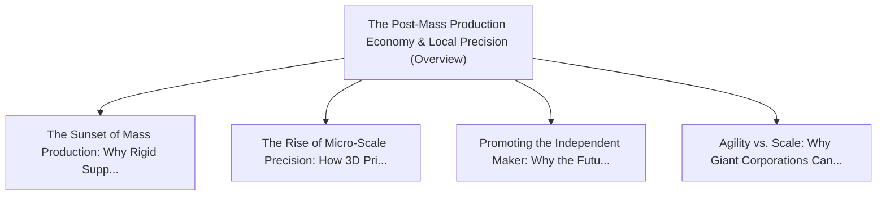

# Series: The Post-Mass Production Economy & Local Precision

> **Series Scope**: This master document anchors the multi-part series on **The Post-Mass Production
> Economy & Local Precision**. It outlines the overarching thesis, establishes the foundational
> principles, and cross-links all detailed sub-topic investigations below.

---

## 🗺️ Series Roadmap & Topic Graph

---

## 1. Master Thesis & Architecture

### The Core Premise

The era of rigid global mass production is giving way to localized additive manufacturing, on-demand
precision, and independent micro-enterprises.

### The Counter-Perspective (Steel-Manning Consensus)

Gigantic industrial factories still produce commoditized goods (semiconductors, raw steel) at
unbeatable unit costs.

### Nuances & Blind Spots

- Navigating the transition from legacy systems and habits to new models requires intentional
  scaffolding.
- Balancing forward-looking architectural ideals with immediate operational constraints.

---

## 2. Evidence, Stories & Analogies

### Personal Anecdotes & Field Experience

- Watching 3D printers and local CNC shops produce custom replacement parts that global suppliers
  discontinued 10 years ago.

### Metaphors & Mental Models

- **Moving from a gigantic textile mill weaving millions of identical grey shirts to a digital
  tailor in every town.**

---

## 3. Series Reading Order & Topic Breakdowns

| Part   | Title & Link                                                                                                                              | Key Focus / Takeaway                                                                          |
| :----- | :---------------------------------------------------------------------------------------------------------------------------------------- | :-------------------------------------------------------------------------------------------- |
| Part 1 | [[topics/documents/the-sunset-of-mass-production     \| The Sunset of Mass Production: Why Rigid Supply Chains Fail Modern Needs]]        | Mass production demands massive upfront tooling and massive minimum runs, creating enormou... |
| Part 2 | [[topics/documents/the-rise-of-micro-scale-precision \| The Rise of Micro-Scale Precision: How 3D Printing and Local Fab Win]]            | High-precision additive manufacturing enables zero-tooling production, making custom one-o... |
| Part 3 | [[topics/documents/promoting-the-independent-maker   \| Promoting the Independent Maker: Why the Future Belongs to Specialized Artisans]] | Modern CAD, AI design assistants, and digital fabrication empower solo artisans to compete... |
| Part 4 | [[topics/documents/agility-vs-scale                  \| Agility vs. Scale: Why Giant Corporations Cannot Pivot to Niche Demand]]          | Corporate overhead and multi-layer management create institutional inertia, leaving hyper-... |

---

## 4. Multi-Channel Repurposing Matrix

### Medium / Substack (Comprehensive Pillar Essay)

- **Title**: _Series: The Post-Mass Production Economy & Local Precision_
- Narrative arc exploring the systemic forces, historical context, and tactical path forward.

### BlueSky (Anchor Launch Thread)

- **Hook**: "Most discussions about the post-mass production economy & local precision miss the root
  cause. Here is the breakdown of why this shift is inevitable and how to prepare: 🧵"

### YouTube / Podcast

- Long-form deep-dive breaking down the entire series roadmap with visual diagrams and architectural
  proofs.
