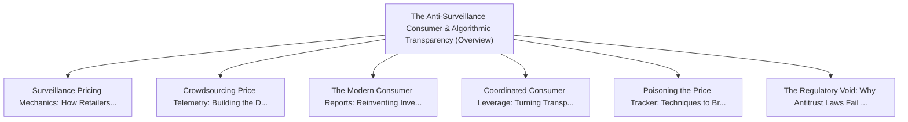

# Series: The Anti-Surveillance Consumer & Algorithmic Transparency

> **Series Scope**: This master document anchors the multi-part series on **The Anti-Surveillance
> Consumer & Algorithmic Transparency**. It outlines the overarching thesis, establishes the
> foundational principles, and cross-links all detailed sub-topic investigations below.

---

## 🗺️ Series Roadmap & Topic Graph

---

## 1. Master Thesis & Architecture

### The Core Premise

How crowdsourced telemetry and open browser tools can expose predatory algorithmic pricing and
restore consumer power.

### The Counter-Perspective (Steel-Manning Consensus)

Dynamic pricing optimizes inventory distribution and airline/hotel capacity utilization.

### Nuances & Blind Spots

- Navigating the transition from legacy systems and habits to new models requires intentional
  scaffolding.
- Balancing forward-looking architectural ideals with immediate operational constraints.

---

## 2. Evidence, Stories & Analogies

### Personal Anecdotes & Field Experience

- Comparing checkout prices on two phones sitting on the same couch and seeing a 30% price
  discrepancy.

### Metaphors & Mental Models

- **Shining a stadium spotlight on a dark auction room where the auctioneer whispers different
  prices to everyone.**

---

## 3. Series Reading Order & Topic Breakdowns

| Part   | Title & Link                                                                                                                                  | Key Focus / Takeaway                                                                          |
| :----- | :-------------------------------------------------------------------------------------------------------------------------------------------- | :-------------------------------------------------------------------------------------------- |
| Part 1 | [[topics/documents/surveillance-pricing-mechanics         \| Surveillance Pricing Mechanics: How Retailers Weaponize Your Digital Exhaust]]   | Retailers use battery level, zip code, device type, and purchase velocity to calculate you... |
| Part 2 | [[topics/documents/crowdsourcing-price-telemetry          \| Crowdsourcing Price Telemetry: Building the Distributed Consumer Watchdog]]      | An open-source browser extension network can aggregate real-time price quotes anonymously ... |
| Part 3 | [[topics/documents/the-modern-consumer-reports            \| The Modern Consumer Reports: Reinventing Investigative Advocacy for the AI Era]] | The 1980s investigative journalism model of Consumer Reports must be reborn as real-time, ... |
| Part 4 | [[topics/documents/coordinated-consumer-leverage          \| Coordinated Consumer Leverage: Turning Transparency into Actionable Boycotts]]   | Individual consumers are powerless against trillion-dollar algorithms, but coordinated col... |
| Part 5 | [[topics/documents/poisoning-the-price-tracker            \| Poisoning the Price Tracker: Techniques to Break Algorithmic Profiling]]         | Injecting synthetic digital noise and randomized purchasing signals degrades the predictiv... |
| Part 6 | [[topics/documents/the-regulatory-void-in-dynamic-pricing \| The Regulatory Void: Why Antitrust Laws Fail at Micro-Targeted Extraction]]      | Current antitrust framework focuses on broad price-fixing between competitors, completely ... |

---

## 4. Multi-Channel Repurposing Matrix

### Medium / Substack (Comprehensive Pillar Essay)

- **Title**: _Series: The Anti-Surveillance Consumer & Algorithmic Transparency_
- Narrative arc exploring the systemic forces, historical context, and tactical path forward.

### BlueSky (Anchor Launch Thread)

- **Hook**: "Most discussions about the anti-surveillance consumer & algorithmic transparency miss
  the root cause. Here is the breakdown of why this shift is inevitable and how to prepare: 🧵"

### YouTube / Podcast

- Long-form deep-dive breaking down the entire series roadmap with visual diagrams and architectural
  proofs.
