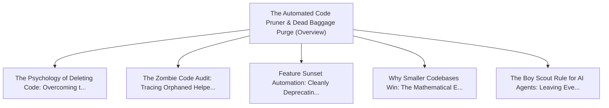

# Series: The Automated Code Pruner & Dead Baggage Purge

> **Series Scope**: This master document anchors the multi-part series on **The Automated Code
> Pruner & Dead Baggage Purge**. It outlines the overarching thesis, establishes the foundational
> principles, and cross-links all detailed sub-topic investigations below.

---

## 🗺️ Series Roadmap & Topic Graph

---

## 1. Master Thesis & Architecture

### The Core Premise

AI agents should not just write new code; their highest ROI role is actively auditing, pruning, and
purging dead code and legacy baggage.

### The Counter-Perspective (Steel-Manning Consensus)

Aggressive automated pruning risks breaking reflection, dynamic imports, and undocumented edge-case
integrations.

### Nuances & Blind Spots

- Navigating the transition from legacy systems and habits to new models requires intentional
  scaffolding.
- Balancing forward-looking architectural ideals with immediate operational constraints.

---

## 2. Evidence, Stories & Analogies

### Personal Anecdotes & Field Experience

- Deleting 40,000 lines of unused legacy features and observing an immediate 30% drop in overall
  application bug tickets.

### Metaphors & Mental Models

- **Pruning dead branches off a fruit tree to allow healthy branches to flourish.**

---

## 3. Series Reading Order & Topic Breakdowns

| Part   | Title & Link                                                                                                                          | Key Focus / Takeaway                                                                          |
| :----- | :------------------------------------------------------------------------------------------------------------------------------------ | :-------------------------------------------------------------------------------------------- |
| Part 1 | [[topics/documents/the-psychology-of-deleting-code  \| The Psychology of Deleting Code: Overcoming the Fear of the Backspace Key]]    | Engineers suffer from sunk-cost fallacy regarding legacy code; real architectural maturity... |
| Part 2 | [[topics/documents/the-zombie-code-audit            \| The Zombie Code Audit: Tracing Orphaned Helpers, Routes, and Schemas with AI]] | Static AST analysis combined with semantic LLM inspection can trace full call graphs to id... |
| Part 3 | [[topics/documents/feature-sunset-automation        \| Feature Sunset Automation: Cleanly Deprecating Features Across the Stack]]     | Sunset should be an automated first-class pipeline that purges API endpoints, UI component... |
| Part 4 | [[topics/documents/why-smaller-codebases-win        \| Why Smaller Codebases Win: The Mathematical Edge of Compact Repositories]]     | Compact codebases fit entirely into AI context windows, build in seconds, and have exponen... |
| Part 5 | [[topics/documents/the-boy-scout-rule-for-ai-agents \| The Boy Scout Rule for AI Agents: Leaving Every File Cleaner Than Found]]      | Embedding pruning instructions in agent system prompts ensures that every feature addition... |

---

## 4. Multi-Channel Repurposing Matrix

### Medium / Substack (Comprehensive Pillar Essay)

- **Title**: _Series: The Automated Code Pruner & Dead Baggage Purge_
- Narrative arc exploring the systemic forces, historical context, and tactical path forward.

### BlueSky (Anchor Launch Thread)

- **Hook**: "Most discussions about the automated code pruner & dead baggage purge miss the root
  cause. Here is the breakdown of why this shift is inevitable and how to prepare: 🧵"

### YouTube / Podcast

- Long-form deep-dive breaking down the entire series roadmap with visual diagrams and architectural
  proofs.
