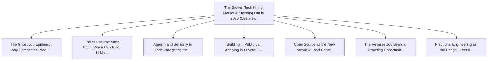

# Series: The Broken Tech Hiring Market & Standing Out in 2026

> **Series Scope**: This master document anchors the multi-part series on **The Broken Tech Hiring
> Market & Standing Out in 2026**. It outlines the overarching thesis, establishes the foundational
> principles, and cross-links all detailed sub-topic investigations below.

---

## 🗺️ Series Roadmap & Topic Graph

---

## 1. Master Thesis & Architecture

### The Core Premise

With automated ATS filters, ghost listings, and AI-inflated resumes, traditional job applications
are broken; public proof-of-work is the new resume.

### The Counter-Perspective (Steel-Manning Consensus)

Traditional recruiting still processes millions of enterprise placements through established agency
channels.

### Nuances & Blind Spots

- Navigating the transition from legacy systems and habits to new models requires intentional
  scaffolding.
- Balancing forward-looking architectural ideals with immediate operational constraints.

---

## 2. Evidence, Stories & Analogies

### Personal Anecdotes & Field Experience

- Sending hundreds of tailored applications into corporate ATS black holes with near-zero human
  response.

### Metaphors & Mental Models

- **Throwing paper resumes into an industrial shredder connected to an automated rejection email
  server.**

---

## 3. Series Reading Order & Topic Breakdowns

| Part   | Title & Link                                                                                                                                               | Key Focus / Takeaway                                                                          |
| :----- | :--------------------------------------------------------------------------------------------------------------------------------------------------------- | :-------------------------------------------------------------------------------------------- |
| Part 1 | [[topics/documents/the-ghost-job-epidemic                    \| The Ghost Job Epidemic: Why Companies Post Listings They Never Intend to Fill]]            | Ghost jobs exist to project fake growth to investors, soothe overworked staff, and harvest... |
| Part 2 | [[topics/documents/the-ai-resume-arms-race                   \| The AI Resume Arms Race: When Candidate LLMs Battle Recruiter ATS LLMs]]                   | When candidates use LLMs to tailor resumes to beat recruiter LLMs, all authentic human sig... |
| Part 3 | [[topics/documents/ageism-and-seniority-in-modern-tech       \| Ageism and Seniority in Tech: Navigating the 2026 Labor Market with 20+ Years Experience]] | Senior engineers face unspoken age and salary biases; reframing 20 years of experience as ... |
| Part 4 | [[topics/documents/building-in-public-vs-applying-in-private \| Building in Public vs. Applying in Private: Creating an Un-Fakeable Trail of Competence]]  | Publishing open-source code, essays, and architectural breakdowns creates permanent inboun... |
| Part 5 | [[topics/documents/open-source-as-the-new-interview          \| Open Source as the New Interview: Real Contributions Over LeetCode Trivia]]                | Merging a clean pull request into an established open-source repo demonstrates collaborati... |
| Part 6 | [[topics/documents/the-reverse-job-search                    \| The Reverse Job Search: Attracting Opportunities Through Targeted Thought Leadership]]     | Writing deeply about specific niche problems signals authority directly to decision-makers... |
| Part 7 | [[topics/documents/fractional-engineering-as-the-bridge      \| Fractional Engineering as the Bridge: Diversifying Beyond the Monolithic Full-Time Role]]  | Senior engineers can de-risk their careers by offering high-leverage 10-hour/week advisory... |

---

## 4. Multi-Channel Repurposing Matrix

### Medium / Substack (Comprehensive Pillar Essay)

- **Title**: _Series: The Broken Tech Hiring Market & Standing Out in 2026_
- Narrative arc exploring the systemic forces, historical context, and tactical path forward.

### BlueSky (Anchor Launch Thread)

- **Hook**: "Most discussions about the broken tech hiring market & standing out in 2026 miss the
  root cause. Here is the breakdown of why this shift is inevitable and how to prepare: 🧵"

### YouTube / Podcast

- Long-form deep-dive breaking down the entire series roadmap with visual diagrams and architectural
  proofs.
