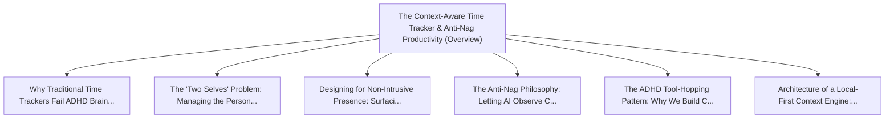

# Series: The Context-Aware Time Tracker & Anti-Nag Productivity

> **Series Scope**: This master document anchors the multi-part series on **The Context-Aware Time
> Tracker & Anti-Nag Productivity**. It outlines the overarching thesis, establishes the
> foundational principles, and cross-links all detailed sub-topic investigations below.

---

## 🗺️ Series Roadmap & Topic Graph

---

## 1. Master Thesis & Architecture

### The Core Premise

Traditional productivity apps fail ADHD brains through alarm fatigue and intrusive nagging; a
context-aware tracker surfaces reminders only when you are ready.

### The Counter-Perspective (Steel-Manning Consensus)

Rigid time-blocking with loud alarms works well for neurotypical schedules.

### Nuances & Blind Spots

- Navigating the transition from legacy systems and habits to new models requires intentional
  scaffolding.
- Balancing forward-looking architectural ideals with immediate operational constraints.

---

## 2. Evidence, Stories & Analogies

### Personal Anecdotes & Field Experience

- Building dozens of custom time trackers over 15 years because every commercial tool became an
  ignored background buzz.

### Metaphors & Mental Models

- **A polite assistant who steps into your office during a natural pause vs a klaxon siren going off
  during a meeting.**

---

## 3. Series Reading Order & Topic Breakdowns

| Part   | Title & Link                                                                                                                                                   | Key Focus / Takeaway                                                                          |
| :----- | :------------------------------------------------------------------------------------------------------------------------------------------------------------- | :-------------------------------------------------------------------------------------------- |
| Part 1 | [[topics/documents/why-time-trackers-fail-adhd-brains           \| Why Traditional Time Trackers Fail ADHD Brains: Alarm Fatigue and Nag-Blindness]]           | When reminders pop up indiscriminately during deep focus or screen shares, the ADHD brain ... |
| Part 2 | [[topics/documents/the-two-selves-problem                       \| The 'Two Selves' Problem: Managing the Personal/Professional Boundary in Remote Work]]      | We are husbands, fathers, and pet owners in our off-time and professionals during the work... |
| Part 3 | [[topics/documents/designing-for-non-intrusive-presence         \| Designing for Non-Intrusive Presence: Surfacing Information at Natural Transition Moments]] | Ambient UI and transition-moment detection allow tools to present critical deadlines witho... |
| Part 4 | [[topics/documents/the-anti-nag-philosophy                      \| The Anti-Nag Philosophy: Letting AI Observe Context Rather Than Demand Attention]]          | Passive context observation (detecting IDE activity, meeting audio, active windows) allows... |
| Part 5 | [[topics/documents/the-adhd-tool-hopping-pattern                \| The ADHD Tool-Hopping Pattern: Why We Build Custom Trackers Instead of Adopting Apps]]      | The cycle of adopting an app, outgrowing its rigid assumptions, and building a custom scri... |
| Part 6 | [[topics/documents/architecture-of-a-local-first-context-engine \| Architecture of a Local-First Context Engine: Privacy, Integration, and AI]]                | A personal context orchestrator must be local-first, storing sensitive calendar and task d... |

---

## 4. Multi-Channel Repurposing Matrix

### Medium / Substack (Comprehensive Pillar Essay)

- **Title**: _Series: The Context-Aware Time Tracker & Anti-Nag Productivity_
- Narrative arc exploring the systemic forces, historical context, and tactical path forward.

### BlueSky (Anchor Launch Thread)

- **Hook**: "Most discussions about the context-aware time tracker & anti-nag productivity miss the
  root cause. Here is the breakdown of why this shift is inevitable and how to prepare: 🧵"

### YouTube / Podcast

- Long-form deep-dive breaking down the entire series roadmap with visual diagrams and architectural
  proofs.
