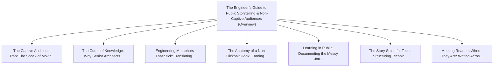

# Series: The Engineer’s Guide to Public Storytelling & Non-Captive Audiences

> **Series Scope**: This master document anchors the multi-part series on **The Engineer’s Guide to
> Public Storytelling & Non-Captive Audiences**. It outlines the overarching thesis, establishes the
> foundational principles, and cross-links all detailed sub-topic investigations below.

---

## 🗺️ Series Roadmap & Topic Graph

---

## 1. Master Thesis & Architecture

### The Core Premise

Moving from internal team communication to public writing requires unlearning jargon and mastering
narrative arcs, empathy, and tactile metaphors.

### The Counter-Perspective (Steel-Manning Consensus)

Pure technical documentation must remain concise, dry, and free of narrative decoration.

### Nuances & Blind Spots

- Navigating the transition from legacy systems and habits to new models requires intentional
  scaffolding.
- Balancing forward-looking architectural ideals with immediate operational constraints.

---

## 2. Evidence, Stories & Analogies

### Personal Anecdotes & Field Experience

- Realizing that brilliant architecture documents were being completely ignored by stakeholders
  because they lacked a narrative hook.

### Metaphors & Mental Models

- **Stepping out of the university lecture hall and onto the public street market stage.**

---

## 3. Series Reading Order & Topic Breakdowns

| Part   | Title & Link                                                                                                                                        | Key Focus / Takeaway                                                                          |
| :----- | :-------------------------------------------------------------------------------------------------------------------------------------------------- | :-------------------------------------------------------------------------------------------- |
| Part 1 | [[topics/documents/the-captive-audience-trap                 \| The Captive Audience Trap: The Shock of Moving from Team Meetings to the Open Web]] | In corporate meetings, colleagues must listen; on the internet, you have 2 seconds to earn... |
| Part 2 | [[topics/documents/the-curse-of-knowledge                    \| The Curse of Knowledge: Why Senior Architects Struggle to Explain Ideas Simply]]    | The more you know, the harder it is to remember what it was like not knowing; great commun... |
| Part 3 | [[topics/documents/engineering-metaphors-that-stick          \| Engineering Metaphors That Stick: Translating Abstract Tech into Tactile Concepts]] | The human brain remembers physical, tactile metaphors 10x better than abstract system diag... |
| Part 4 | [[topics/documents/the-anatomy-of-a-non-clickbait-hook       \| The Anatomy of a Non-Clickbait Hook: Earning Attention with Genuine Curiosity]]     | You do not need sensationalist hype or outrage farming to grab attention; highlighting a g... |
| Part 5 | [[topics/documents/learning-in-public-as-a-storyteller       \| Learning in Public: Documenting the Messy Journey from Engineer to Writer]]         | Readers connect with the struggle of growth far more than the facade of effortless perfect... |
| Part 6 | [[topics/documents/the-story-spine-for-software-architecture \| The Story Spine for Tech: Structuring Technical Decisions as Narrative Arcs]]       | Every technical proposal should follow classic storytelling: Status Quo -> The Conflict/Fa... |
| Part 7 | [[topics/documents/meeting-readers-where-they-are            \| Meeting Readers Where They Are: Writing Across Skill Levels Without Talking Down]]  | High-level communication respects the reader’s intelligence while removing unneeded prereq... |

---

## 4. Multi-Channel Repurposing Matrix

### Medium / Substack (Comprehensive Pillar Essay)

- **Title**: _Series: The Engineer’s Guide to Public Storytelling & Non-Captive Audiences_
- Narrative arc exploring the systemic forces, historical context, and tactical path forward.

### BlueSky (Anchor Launch Thread)

- **Hook**: "Most discussions about the engineer’s guide to public storytelling & non-captive
  audiences miss the root cause. Here is the breakdown of why this shift is inevitable and how to
  prepare: 🧵"

### YouTube / Podcast

- Long-form deep-dive breaking down the entire series roadmap with visual diagrams and architectural
  proofs.
