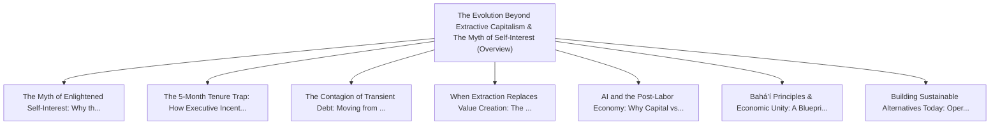

# Series: The Evolution Beyond Extractive Capitalism & The Myth of Self-Interest

> **Series Scope**: This master document anchors the multi-part series on **The Evolution Beyond
> Extractive Capitalism & The Myth of Self-Interest**. It outlines the overarching thesis,
> establishes the foundational principles, and cross-links all detailed sub-topic investigations
> below.

---

## 🗺️ Series Roadmap & Topic Graph

---

## 1. Master Thesis & Architecture

### The Core Premise

Short-term executive extraction, insular optimization, and zero-marginal-cost AI are breaking
classical market models, necessitating a shift toward cooperative, systems-level economics.

### The Counter-Perspective (Steel-Manning Consensus)

Free markets have historically generated immense capital accumulation and technological
acceleration.

### Nuances & Blind Spots

- Navigating the transition from legacy systems and habits to new models requires intentional
  scaffolding.
- Balancing forward-looking architectural ideals with immediate operational constraints.

---

## 2. Evidence, Stories & Analogies

### Personal Anecdotes & Field Experience

- Witnessing profitable, productive divisions dismantled to satisfy quarterly earnings targets for
  departing executives.

### Metaphors & Mental Models

- **Burning the load-bearing wooden beams of a house to keep the fireplace warm for one evening.**

---

## 3. Series Reading Order & Topic Breakdowns

| Part   | Title & Link                                                                                                                                         | Key Focus / Takeaway                                                                          |
| :----- | :--------------------------------------------------------------------------------------------------------------------------------------------------- | :-------------------------------------------------------------------------------------------- |
| Part 1 | [[topics/documents/the-myth-of-enlightened-self-interest   \| The Myth of Enlightened Self-Interest: Why the 'Invisible Hand' Is Broken]]            | When corporate structures insulate decision-makers from the societal harm of their choices... |
| Part 2 | [[topics/documents/the-five-month-tenure-trap              \| The 5-Month Tenure Trap: How Executive Incentives Destroy Long-Term Enterprise Value]] | Transient executives are incentivized to slash R&D, lay off key talent, pump short-term nu... |
| Part 3 | [[topics/documents/the-contagion-of-transient-debt         \| The Contagion of Transient Debt: Moving from One Broken Company to Another]]           | Because short-term executive churn is ubiquitous, engineers hopping between companies simp... |
| Part 4 | [[topics/documents/when-extraction-replaces-value-creation \| When Extraction Replaces Value Creation: The Late-Stage Corporate Playbook]]           | When companies run out of genuine innovations, they pivot to financial engineering, subscr... |
| Part 5 | [[topics/documents/ai-and-the-post-labor-economy           \| AI and the Post-Labor Economy: Why Capital vs. Labor Economics Must Evolve]]           | When cognitive labor reaches near-zero marginal cost, the foundational premise of exchangi... |
| Part 6 | [[topics/documents/bahai-principles-and-economic-unity     \| Bahá’í Principles & Economic Unity: A Blueprint for Long-Term Stewardship]]            | Integrating spiritual principles—voluntary profit-sharing, consultation, elimination of ex... |
| Part 7 | [[topics/documents/building-sustainable-alternatives-today \| Building Sustainable Alternatives Today: Operating Outside the Extractive Playbook]]   | Engineers and creators do not have to wait for global policy; we can build worker co-ops, ... |

---

## 4. Multi-Channel Repurposing Matrix

### Medium / Substack (Comprehensive Pillar Essay)

- **Title**: _Series: The Evolution Beyond Extractive Capitalism & The Myth of Self-Interest_
- Narrative arc exploring the systemic forces, historical context, and tactical path forward.

### BlueSky (Anchor Launch Thread)

- **Hook**: "Most discussions about the evolution beyond extractive capitalism & the myth of
  self-interest miss the root cause. Here is the breakdown of why this shift is inevitable and how
  to prepare: 🧵"

### YouTube / Podcast

- Long-form deep-dive breaking down the entire series roadmap with visual diagrams and architectural
  proofs.
