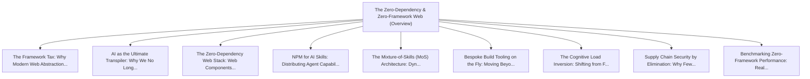

# Series: The Zero-Dependency & Zero-Framework Web

> **Series Scope**: This master document anchors the multi-part series on **The Zero-Dependency &
> Zero-Framework Web**. It outlines the overarching thesis, establishes the foundational principles,
> and cross-links all detailed sub-topic investigations below.

---

## 🗺️ Series Roadmap & Topic Graph

---

## 1. Master Thesis & Architecture

### The Core Premise

How modern Web Standards combined with local AI skills make 90% of runtime framework dependencies
obsolete, ushering in an era of pure, lean, durable native code.

### The Counter-Perspective (Steel-Manning Consensus)

Frameworks provide turnkey component ecosystems and uniform hiring profiles.

### Nuances & Blind Spots

- Navigating the transition from legacy systems and habits to new models requires intentional
  scaffolding.
- Balancing forward-looking architectural ideals with immediate operational constraints.

---

## 2. Evidence, Stories & Analogies

### Personal Anecdotes & Field Experience

- Watching enterprise projects rewrite frontends 3 times across 10 years for zero business gain.

### Metaphors & Mental Models

- **Replacing prefabricated plastic room kits with an on-demand master carpenter using native
  lumber.**

---

## 3. Series Reading Order & Topic Breakdowns

| Part   | Title & Link                                                                                                                                      | Key Focus / Takeaway                                                                          |
| :----- | :------------------------------------------------------------------------------------------------------------------------------------------------ | :-------------------------------------------------------------------------------------------- |
| Part 1 | [[topics/documents/the-framework-tax                       \| The Framework Tax: Why Modern Web Abstractions Cost More Than They Deliver]]        | Frameworks were invented for human cognitive limitations, but impose an ongoing maintenanc... |
| Part 2 | [[topics/documents/ai-as-the-ultimate-transpiler           \| AI as the Ultimate Transpiler: Why We No Longer Need Giant Runtime Bundles]]        | When an AI agent can generate clean, bespoke vanilla code and local helpers in seconds, im... |
| Part 3 | [[topics/documents/the-zero-dependency-web-stack           \| The Zero-Dependency Web Stack: Web Components, CSS Grid, and Native APIs]]          | Modern browser standards (Web Components, CSS Grid/Subgrid, View Transitions, Dialog) make... |
| Part 4 | [[topics/documents/npm-for-ai-skills-not-packages          \| NPM for AI Skills: Distributing Agent Capabilities Instead of Bloated Code]]        | The future package manager will distribute composable agent rules, skills, and prompts rat... |
| Part 5 | [[topics/documents/the-mixture-of-skills-architecture      \| The Mixture-of-Skills (MoS) Architecture: Dynamic Agent Specialization]]            | Rather than paying for gigantic monolithic context windows, dynamic skill routing activate... |
| Part 6 | [[topics/documents/bespoke-build-tooling-on-the-fly        \| Bespoke Build Tooling on the Fly: Moving Beyond Monolithic Bundlers]]               | Ephemeral, AI-generated build scripts tailored precisely to a project eliminate the need f... |
| Part 7 | [[topics/documents/the-cognitive-load-inversion            \| The Cognitive Load Inversion: Shifting from Framework APIs to Platform Primitives]] | Mastering foundational platform primitives has a 20-year half-life; mastering framework li... |
| Part 8 | [[topics/documents/supply-chain-security-by-elimination    \| Supply Chain Security by Elimination: Why Fewer Dependencies Mean Fewer CVEs]]      | The single most effective software security strategy is eliminating unvetted third-party t... |
| Part 9 | [[topics/documents/benchmarking-zero-framework-performance \| Benchmarking Zero-Framework Performance: Real-World Core Web Vitals]]               | Shipping zero framework runtime yields instant sub-50ms Interaction to Next Paint (INP) an... |

---

## 4. Multi-Channel Repurposing Matrix

### Medium / Substack (Comprehensive Pillar Essay)

- **Title**: _Series: The Zero-Dependency & Zero-Framework Web_
- Narrative arc exploring the systemic forces, historical context, and tactical path forward.

### BlueSky (Anchor Launch Thread)

- **Hook**: "Most discussions about the zero-dependency & zero-framework web miss the root cause.
  Here is the breakdown of why this shift is inevitable and how to prepare: 🧵"

### YouTube / Podcast

- Long-form deep-dive breaking down the entire series roadmap with visual diagrams and architectural
  proofs.
