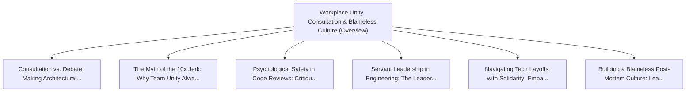

# Series: Workplace Unity, Consultation & Blameless Culture

> **Series Scope**: This master document anchors the multi-part series on **Workplace Unity,
> Consultation & Blameless Culture**. It outlines the overarching thesis, establishes the
> foundational principles, and cross-links all detailed sub-topic investigations below.

---

## 🗺️ Series Roadmap & Topic Graph

---

## 1. Master Thesis & Architecture

### The Core Premise

Applying principle-centered consultation to engineering teams replaces destructive ego battles with
genuine collective intelligence.

### The Counter-Perspective (Steel-Manning Consensus)

Fast-moving startups often demand authoritative, single-dictator decision making for raw speed.

### Nuances & Blind Spots

- Navigating the transition from legacy systems and habits to new models requires intentional
  scaffolding.
- Balancing forward-looking architectural ideals with immediate operational constraints.

---

## 2. Evidence, Stories & Analogies

### Personal Anecdotes & Field Experience

- Transforming a toxic, faction-ridden engineering department into a collaborative powerhouse
  through consultative decision-making.

### Metaphors & Mental Models

- **Harmonizing separate instruments in an orchestra rather than having soloists shout over each
  other.**

---

## 3. Series Reading Order & Topic Breakdowns

| Part   | Title & Link                                                                                                                                        | Key Focus / Takeaway                                                                          |
| :----- | :-------------------------------------------------------------------------------------------------------------------------------------------------- | :-------------------------------------------------------------------------------------------- |
| Part 1 | [[topics/documents/consultation-vs-debate                   \| Consultation vs. Debate: Making Architectural Decisions Without Ego Battles]]        | In debate, people defend their ideas like territory; in true consultation, an idea belongs... |
| Part 2 | [[topics/documents/the-myth-of-the-10x-jerk                 \| The Myth of the 10x Jerk: Why Team Unity Always Outperforms Isolated Genius]]        | A toxic high-performer creates systemic negative externalities—fear, turnover, withheld in... |
| Part 3 | [[topics/documents/psychological-safety-in-code-reviews     \| Psychological Safety in Code Reviews: Critique the Code, Elevate the Person]]        | Code reviews should be celebratory mentorship rituals that build confidence, not gatekeepi... |
| Part 4 | [[topics/documents/servant-leadership-in-engineering        \| Servant Leadership in Engineering: The Leader as Chief Roadblock Remover]]           | True authority in engineering is earned through humble service, shield-bearing against cor... |
| Part 5 | [[topics/documents/navigating-tech-layoffs-with-solidarity  \| Navigating Tech Layoffs with Solidarity: Empathy in Times of Corporate Contraction]] | Layoffs reveal the true soul of a company; treating departing colleagues with dignity and ... |
| Part 6 | [[topics/documents/building-a-blameless-post-mortem-culture \| Building a Blameless Post-Mortem Culture: Learning from Production Outages]]         | When outages happen, blaming individuals guarantees future incidents will be hidden; analy... |

---

## 4. Multi-Channel Repurposing Matrix

### Medium / Substack (Comprehensive Pillar Essay)

- **Title**: _Series: Workplace Unity, Consultation & Blameless Culture_
- Narrative arc exploring the systemic forces, historical context, and tactical path forward.

### BlueSky (Anchor Launch Thread)

- **Hook**: "Most discussions about workplace unity, consultation & blameless culture miss the root
  cause. Here is the breakdown of why this shift is inevitable and how to prepare: 🧵"

### YouTube / Podcast

- Long-form deep-dive breaking down the entire series roadmap with visual diagrams and architectural
  proofs.
