# Stop Blindly Following Patterns: Clean Code, History, and the Hammer Fallacy

## 🗺️ Topic Mind Map

```mermaid
graph TD
    PATTERNS["Stop Blindly Following Patterns"]

    %% Branches
    PATTERNS --> HISTORY["1. The History of Gang of Four & Clean Code"]
    PATTERNS --> CARGO["2. The Cargo Culting Trap"]
    PATTERNS --> PROBLEM_FIRST["3. Problem-First vs Pattern-First"]
    PATTERNS --> STEELMAN["4. Counter-Perspective: Value of Patterns"]
    PATTERNS --> REPURPOSE["5. Multi-Platform Media"]

    %% History
    HISTORY --> CONSTRAINTS["Patterns were invented for specific language limitations (C++, Smalltalk, Java 1.1)"]
    HISTORY --> EVOLUTION["Modern languages have built-in language primitives replacing old patterns"]

    %% Cargo
    CARGO --> HAMMER["'I just learned AbstractFactory, now everything looks like a Factory'"]
    CARGO --> INDIRECTION["Unnecessary indirection, boilerplate, and cognitive load"]

    %% Problem First
    PROBLEM_FIRST --> PAIN["Only apply a pattern when you actively feel the architectural pain it relieves"]
    PROBLEM_FIRST --> SIMPLICITY["Default to the simplest dumb code that solves the problem"]

    %% Steelman
    STEELMAN --> VOCAB["Patterns provide a shared taxonomy across senior engineering teams"]
    STEELMAN --> SCALE["Crucial for massive distributed systems with decoupled teams"]

    %% Repurpose
    REPURPOSE --> MED["Medium: Comprehensive Architecture Essay"]
    REPURPOSE --> BS["BlueSky: 5-Post Pattern Breakdown"]
    REPURPOSE --> YT["YouTube: Visual Code Comparison"]
```

---

## 1. Core Thesis & Nuance

### The Core Premise

Design patterns (GoF, Clean Code, Enterprise Patterns) were formulated to solve specific, painful
problems arising in particular programming paradigms and era-specific language constraints (like
early C++ and Java). Junior and mid-level developers often fall into cargo-culting—treating patterns
as a checklist of "good code" to be applied everywhere. Applying a pattern before you have felt the
pain it was invented to heal is like using a sledgehammer on a tiny drywall screw just because you
own a sledgehammer.

### The Counter-Perspective (Steel-Manning Patterns)

1. **Shared Architectural Taxonomy**: Saying "Let's use an Adapter here" conveys an entire
   architectural strategy in three words to senior teammates.
2. **Preventing Reinvented Mistakes**: Proven patterns encode decades of hard-won lessons in
   decoupling, lifecycle management, and concurrency.
3. **Enterprise Extensibility**: In large codebases with dozens of teams, patterns establish
   predictable seams for extension without modifying core code (Open-Closed Principle).

### Blind Spots & Nuances

- Distinguishing between _premature abstraction_ and _pragmatic future-proofing_.
- Recognizing when modern language features (first-class functions, closures, pattern matching) make
  traditional OOP patterns obsolete.

---

## 2. Evidence & Story Bank

### Personal Anecdotes

- Reviewing PRs where a 20-line utility function was turned into 8 classes, interfaces, and
  factories in the name of "Clean Code."
- Refactoring complex visitor and strategy hierarchies back into simple lookup maps and pure
  functions.

### Metaphors & Analogies

- **The Heavy Toolkit**: You don't bring a pneumatic jackhammer to hang a family picture on the
  wall. Tools have mass, and patterns have architectural weight. If the problem is light, keep the
  tool light.

---

## 3. Multi-Channel Repurposing Matrix

### Medium (Anchor Essay)

- **Title**: _Stop Blindly Following Patterns: Understanding the History of Clean Code Before You
  Wreck Your Architecture_
- **Sections**:
  1. The "I Just Learned Design Patterns" Phase Every Engineer Goes Through.
  2. Why the Gang of Four Wrote What They Wrote (Context Matters).
  3. The Cost of Unnecessary Indirection.
  4. The Golden Rule: Suffer the Pain First, Then Apply the Pattern.

### BlueSky (Thread)

- **Hook**: "Don't use a hammer on a screw just because you know how to swing it. Here is why
  blindly following 'Clean Code' design patterns is the #1 cause of over-engineered software: 🧵"

---

## 4. Interactive Discussion Prompt

> _"What is the most hilariously over-engineered implementation of a design pattern you've ever had
> to maintain?"_
