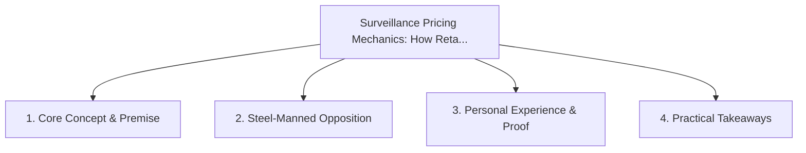

# Surveillance Pricing Mechanics: How Retailers Weaponize Your Digital Exhaust

<!-- prettier-ignore-start -->
<!-- markdownlint-disable MD013 -->
**Series Context**: Part 1 of the [[topics/documents/series-the-anti-surveillance-consumer|The Anti-Surveillance Consumer & Algorithmic Transparency]] series.
<!-- markdownlint-restore -->
<!-- prettier-ignore-end -->

---

## 🗺️ Topic Mind Map

---

## 1. Deep-Dive Knowledge & Context

### Core Insight

Retailers use battery level, zip code, device type, and purchase velocity to calculate your maximum
willingness to pay in real-time.

### Counter-Perspective (Steel-Manning)

Personalized promotions provide discounts to price-sensitive shoppers.

### Nuances & Blind Spots

- Practical implementation edge cases when adopting this approach in production environments.
- Distinguishing between dogmatic application and context-sensitive pragmatism.

---

## 2. Evidence, Stories & Reference Vault

### Personal Anecdotes & Field Experience

- Watching flight ticket prices jump $80 immediately after a second page reload on an iPhone.

### Metaphors & Analogies

- **A car salesman reading your credit card balance before handing you the price tag.**

---

## 3. Practical Action & Takeaways

1. **First Step**: Audit existing workflows or codebases for this specific failure mode or pattern.
2. **Rule of Thumb**: Prefer explicit, decoupled, and durable implementations over transient
   convenience.
3. **Core Metric**: Reduced maintenance friction, lower cognitive load, and sustained velocity.

---

## 4. Multi-Channel Repurposing Matrix

### Medium / Substack (Focused Deep Dive)

- Narrative arc exploring the problem, field scar tissue, counter-arguments, and solution.

### BlueSky (Micro & Thread Hook)

- **Hook**: "A counter-intuitive lesson from 20+ years of engineering: Retailers use battery level,
  zip code, device type, and purchase velocity to calculate your maximum willingness to pay i... 🧵"

### YouTube / TikTok (Short & Video Vector)

- **Hook**: 60-second walkthrough centered on the metaphor: _A car salesman reading your credit card
  balance before handing you the price tag._.
