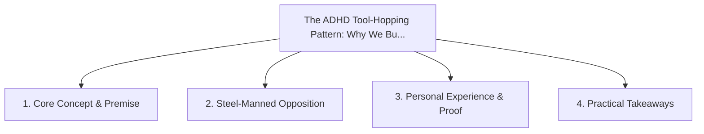

# The ADHD Tool-Hopping Pattern: Why We Build Custom Trackers Instead of Adopting Apps

<!-- prettier-ignore-start -->
<!-- markdownlint-disable MD013 -->
**Series Context**: Part 5 of the [[topics/documents/series-the-context-aware-time-tracker|The Context-Aware Time Tracker & Anti-Nag Productivity]] series.
<!-- markdownlint-restore -->
<!-- prettier-ignore-end -->

---

## 🗺️ Topic Mind Map

---

## 1. Deep-Dive Knowledge & Context

### Core Insight

The cycle of adopting an app, outgrowing its rigid assumptions, and building a custom script is a
search for tooling that respects neurodivergent autonomy.

### Counter-Perspective (Steel-Manning)

Building custom tools is often a classic distraction from doing the primary revenue-generating work.

### Nuances & Blind Spots

- Practical implementation edge cases when adopting this approach in production environments.
- Distinguishing between dogmatic application and context-sensitive pragmatism.

---

## 2. Evidence, Stories & Reference Vault

### Personal Anecdotes & Field Experience

- Looking back at a folder of 12 custom time-tracking CLI scripts built across different jobs.

### Metaphors & Analogies

- **A gardener carving custom wooden handles for every spade to fit their exact grip.**

---

## 3. Practical Action & Takeaways

1. **First Step**: Audit existing workflows or codebases for this specific failure mode or pattern.
2. **Rule of Thumb**: Prefer explicit, decoupled, and durable implementations over transient
   convenience.
3. **Core Metric**: Reduced maintenance friction, lower cognitive load, and sustained velocity.

---

## 4. Multi-Channel Repurposing Matrix

### Medium / Substack (Focused Deep Dive)

- Narrative arc exploring the problem, field scar tissue, counter-arguments, and solution.

### BlueSky (Micro & Thread Hook)

- **Hook**: "A counter-intuitive lesson from 20+ years of engineering: The cycle of adopting an app,
  outgrowing its rigid assumptions, and building a custom script is a search for tooling tha... 🧵"

### YouTube / TikTok (Short & Video Vector)

- **Hook**: 60-second walkthrough centered on the metaphor: _A gardener carving custom wooden
  handles for every spade to fit their exact grip._.
