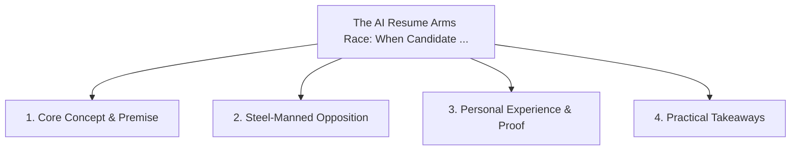

# The AI Resume Arms Race: When Candidate LLMs Battle Recruiter ATS LLMs

<!-- prettier-ignore-start -->
<!-- markdownlint-disable MD013 -->
**Series Context**: Part 2 of the [[topics/documents/series-the-broken-tech-hiring-market|The Broken Tech Hiring Market & Standing Out in 2026]] series.
<!-- markdownlint-restore -->
<!-- prettier-ignore-end -->

---

## 🗺️ Topic Mind Map

---

## 1. Deep-Dive Knowledge & Context

### Core Insight

When candidates use LLMs to tailor resumes to beat recruiter LLMs, all authentic human signals are
stripped out, destroying the hiring funnel.

### Counter-Perspective (Steel-Manning)

AI matching helps recruiters parse 5,000 global applicants per role down to a manageable shortlist.

### Nuances & Blind Spots

- Practical implementation edge cases when adopting this approach in production environments.
- Distinguishing between dogmatic application and context-sensitive pragmatism.

---

## 2. Evidence, Stories & Reference Vault

### Personal Anecdotes & Field Experience

- Watching candidates generate 50-page buzzword-stuffed profiles to score 99% on algorithmic ATS
  screeners.

### Metaphors & Analogies

- **Two automated trading bots trading synthetic securities in an empty room.**

---

## 3. Practical Action & Takeaways

1. **First Step**: Audit existing workflows or codebases for this specific failure mode or pattern.
2. **Rule of Thumb**: Prefer explicit, decoupled, and durable implementations over transient
   convenience.
3. **Core Metric**: Reduced maintenance friction, lower cognitive load, and sustained velocity.

---

## 4. Multi-Channel Repurposing Matrix

### Medium / Substack (Focused Deep Dive)

- Narrative arc exploring the problem, field scar tissue, counter-arguments, and solution.

### BlueSky (Micro & Thread Hook)

- **Hook**: "A counter-intuitive lesson from 20+ years of engineering: When candidates use LLMs to
  tailor resumes to beat recruiter LLMs, all authentic human signals are stripped out, destroy...
  🧵"

### YouTube / TikTok (Short & Video Vector)

- **Hook**: 60-second walkthrough centered on the metaphor: _Two automated trading bots trading
  synthetic securities in an empty room._.
