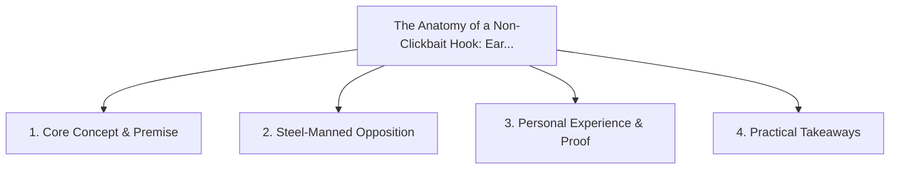

# The Anatomy of a Non-Clickbait Hook: Earning Attention with Genuine Curiosity

<!-- prettier-ignore-start -->
<!-- markdownlint-disable MD013 -->
**Series Context**: Part 4 of the [[topics/documents/series-the-engineers-guide-to-storytelling|The Engineer’s Guide to Public Storytelling & Non-Captive Audiences]] series.
<!-- markdownlint-restore -->
<!-- prettier-ignore-end -->

---

## 🗺️ Topic Mind Map

---

## 1. Deep-Dive Knowledge & Context

### Core Insight

You do not need sensationalist hype or outrage farming to grab attention; highlighting a genuine,
relatable contradiction hooks smart readers immediately.

### Counter-Perspective (Steel-Manning)

Sensationalist clickbait undeniably produces high short-term click-through rates on algorithm feeds.

### Nuances & Blind Spots

- Practical implementation edge cases when adopting this approach in production environments.
- Distinguishing between dogmatic application and context-sensitive pragmatism.

---

## 2. Evidence, Stories & Reference Vault

### Personal Anecdotes & Field Experience

- Comparing engagement between an outrage-bait title and a thoughtful contradiction hook.

### Metaphors & Analogies

- **Offering a sample of fresh artisan bread vs waving a loud plastic whistle.**

---

## 3. Practical Action & Takeaways

1. **First Step**: Audit existing workflows or codebases for this specific failure mode or pattern.
2. **Rule of Thumb**: Prefer explicit, decoupled, and durable implementations over transient
   convenience.
3. **Core Metric**: Reduced maintenance friction, lower cognitive load, and sustained velocity.

---

## 4. Multi-Channel Repurposing Matrix

### Medium / Substack (Focused Deep Dive)

- Narrative arc exploring the problem, field scar tissue, counter-arguments, and solution.

### BlueSky (Micro & Thread Hook)

- **Hook**: "A counter-intuitive lesson from 20+ years of engineering: You do not need
  sensationalist hype or outrage farming to grab attention; highlighting a genuine, relatable
  contradictio... 🧵"

### YouTube / TikTok (Short & Video Vector)

- **Hook**: 60-second walkthrough centered on the metaphor: _Offering a sample of fresh artisan
  bread vs waving a loud plastic whistle._.
