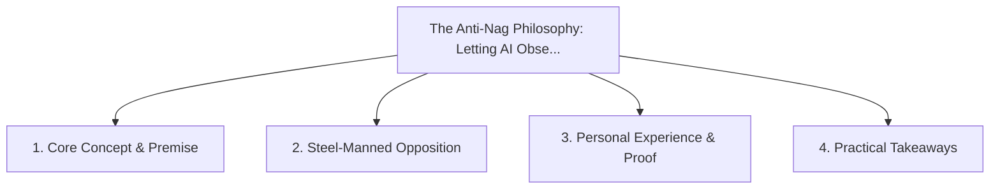

# The Anti-Nag Philosophy: Letting AI Observe Context Rather Than Demand Attention

<!-- prettier-ignore-start -->
<!-- markdownlint-disable MD013 -->
**Series Context**: Part 4 of the [[topics/documents/series-the-context-aware-time-tracker|The Context-Aware Time Tracker & Anti-Nag Productivity]] series.
<!-- markdownlint-restore -->
<!-- prettier-ignore-end -->

---

## 🗺️ Topic Mind Map

---

## 1. Deep-Dive Knowledge & Context

### Core Insight

Passive context observation (detecting IDE activity, meeting audio, active windows) allows AI to
stage information intelligently without asking for input.

### Counter-Perspective (Steel-Manning)

Continuous background system activity tracking raises local resource and privacy considerations.

### Nuances & Blind Spots

- Practical implementation edge cases when adopting this approach in production environments.
- Distinguishing between dogmatic application and context-sensitive pragmatism.

---

## 2. Evidence, Stories & Reference Vault

### Personal Anecdotes & Field Experience

- Having an AI assistant withhold non-urgent notifications because it observed an active git merge
  conflict in progress.

### Metaphors & Analogies

- **A butler who waits for you to finish speaking before handing you an envelope.**

---

## 3. Practical Action & Takeaways

1. **First Step**: Audit existing workflows or codebases for this specific failure mode or pattern.
2. **Rule of Thumb**: Prefer explicit, decoupled, and durable implementations over transient
   convenience.
3. **Core Metric**: Reduced maintenance friction, lower cognitive load, and sustained velocity.

---

## 4. Multi-Channel Repurposing Matrix

### Medium / Substack (Focused Deep Dive)

- Narrative arc exploring the problem, field scar tissue, counter-arguments, and solution.

### BlueSky (Micro & Thread Hook)

- **Hook**: "A counter-intuitive lesson from 20+ years of engineering: Passive context observation
  (detecting IDE activity, meeting audio, active windows) allows AI to stage information intel...
  🧵"

### YouTube / TikTok (Short & Video Vector)

- **Hook**: 60-second walkthrough centered on the metaphor: _A butler who waits for you to finish
  speaking before handing you an envelope._.
