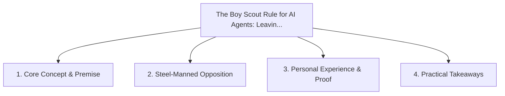

# The Boy Scout Rule for AI Agents: Leaving Every File Cleaner Than Found

<!-- prettier-ignore-start -->
<!-- markdownlint-disable MD013 -->
**Series Context**: Part 5 of the [[topics/documents/series-the-automated-code-pruner|The Automated Code Pruner & Dead Baggage Purge]] series.
<!-- markdownlint-restore -->
<!-- prettier-ignore-end -->

---

## 🗺️ Topic Mind Map

---

## 1. Deep-Dive Knowledge & Context

### Core Insight

Embedding pruning instructions in agent system prompts ensures that every feature addition
automatically cleans surrounding unused imports and cruft.

### Counter-Perspective (Steel-Manning)

Unrelated edits in PR diffs can complicate code reviews and make git blame history noisy.

### Nuances & Blind Spots

- Practical implementation edge cases when adopting this approach in production environments.
- Distinguishing between dogmatic application and context-sensitive pragmatism.

---

## 2. Evidence, Stories & Reference Vault

### Personal Anecdotes & Field Experience

- Enforcing a strict lint/prune hook that rejected any PR that increased net dead symbols.

### Metaphors & Analogies

- **A hiker packing out trash along the trail every time they take a step.**

---

## 3. Practical Action & Takeaways

1. **First Step**: Audit existing workflows or codebases for this specific failure mode or pattern.
2. **Rule of Thumb**: Prefer explicit, decoupled, and durable implementations over transient
   convenience.
3. **Core Metric**: Reduced maintenance friction, lower cognitive load, and sustained velocity.

---

## 4. Multi-Channel Repurposing Matrix

### Medium / Substack (Focused Deep Dive)

- Narrative arc exploring the problem, field scar tissue, counter-arguments, and solution.

### BlueSky (Micro & Thread Hook)

- **Hook**: "A counter-intuitive lesson from 20+ years of engineering: Embedding pruning
  instructions in agent system prompts ensures that every feature addition automatically cleans
  surround... 🧵"

### YouTube / TikTok (Short & Video Vector)

- **Hook**: 60-second walkthrough centered on the metaphor: _A hiker packing out trash along the
  trail every time they take a step._.
