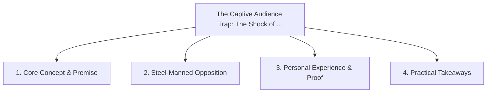

# The Captive Audience Trap: The Shock of Moving from Team Meetings to the Open Web

<!-- prettier-ignore-start -->
<!-- markdownlint-disable MD013 -->
**Series Context**: Part 1 of the [[topics/documents/series-the-engineers-guide-to-storytelling|The Engineer’s Guide to Public Storytelling & Non-Captive Audiences]] series.
<!-- markdownlint-restore -->
<!-- prettier-ignore-end -->

---

## 🗺️ Topic Mind Map

---

## 1. Deep-Dive Knowledge & Context

### Core Insight

In corporate meetings, colleagues must listen; on the internet, you have 2 seconds to earn attention
before the reader scrolls away.

### Counter-Perspective (Steel-Manning)

Captive audiences still give false feedback—polite nodding does not mean real comprehension or
buy-in.

### Nuances & Blind Spots

- Practical implementation edge cases when adopting this approach in production environments.
- Distinguishing between dogmatic application and context-sensitive pragmatism.

---

## 2. Evidence, Stories & Reference Vault

### Personal Anecdotes & Field Experience

- Giving an internal tech talk to 50 silent colleagues vs posting a summary online and receiving 200
  vibrant comments.

### Metaphors & Analogies

- **Performing for friends in your living room vs playing guitar on a noisy subway platform.**

---

## 3. Practical Action & Takeaways

1. **First Step**: Audit existing workflows or codebases for this specific failure mode or pattern.
2. **Rule of Thumb**: Prefer explicit, decoupled, and durable implementations over transient
   convenience.
3. **Core Metric**: Reduced maintenance friction, lower cognitive load, and sustained velocity.

---

## 4. Multi-Channel Repurposing Matrix

### Medium / Substack (Focused Deep Dive)

- Narrative arc exploring the problem, field scar tissue, counter-arguments, and solution.

### BlueSky (Micro & Thread Hook)

- **Hook**: "A counter-intuitive lesson from 20+ years of engineering: In corporate meetings,
  colleagues must listen; on the internet, you have 2 seconds to earn attention before the reader
  s... 🧵"

### YouTube / TikTok (Short & Video Vector)

- **Hook**: 60-second walkthrough centered on the metaphor: _Performing for friends in your living
  room vs playing guitar on a noisy subway platform._.
