# The Charisma Trap & The Danger of Being the Smartest Person in the Room

## 🗺️ Topic Mind Map

```mermaid
graph TD
    CHARISMA["The Charisma & Smartest-in-Room Trap"]

    %% Branches
    CHARISMA --> HIRING_BIAS["1. The Charisma Bias in Hiring"]
    CHARISMA --> SMARTEST["2. The 'Smartest in the Room' Paradox"]
    CHARISMA --> IMPACT["3. True Engineering Effectiveness"]
    CHARISMA --> STEELMAN["4. Counter-Perspective: Value of Confidence"]
    CHARISMA --> REPURPOSE["5. Multi-Platform Formats"]

    %% Hiring Bias
    HIRING_BIAS --> CONFIDENCE["Mistaking confidence and fluency for competence"]
    HIRING_BIAS --> INTROVERTS["Discounting thoughtful, introverted candidates who pause to think"]

    %% Smartest
    SMARTEST --> BOTTLENECK["The 'brilliant jerk' creates architectural bottlenecks"]
    SMARTEST --> ALIENATION["Alienating peers and stifling junior team growth"]
    SMARTEST --> INTELLECT_VS_EQ["High IQ without EQ leads to technically clever, unmaintainable systems"]

    %% Impact
    IMPACT --> MULTIPLIER["Great engineers are force multipliers, not lone heroes"]
    IMPACT --> LISTENING["Effectiveness = Listening + Clarity + Empathy + Code"]

    %% Steelman
    STEELMAN --> INSPIRING["Charismatic leaders can rally teams through crises"]
    STEELMAN --> ADVOCACY["Confidence is essential when defending architecture to non-technical executives"]

    %% Repurpose
    REPURPOSE --> MED["Medium: Leadership Deep Dive"]
    REPURPOSE --> BS["BlueSky: Hiring Insights Thread"]
    REPURPOSE --> YT["YouTube: Whiteboard / Interview Breakdown"]
```

---

## 1. Core Thesis & Nuance

### The Core Premise
In interviews and promotions, humans are wired to favor certainty, fast speech, and charismatic confidence over thoughtful nuance. However, the candidate who has an immediate, unyielding answer to every complex system design question is often the most dangerous hire. Furthermore, being the "smartest person in the room" is an anti-goal: true engineering leadership is not about demonstrating individual intellectual superiority, but about being a force multiplier who makes everyone else around you smarter, calmer, and more capable.

### The Counter-Perspective (Steel-Manning Confidence)
1. **Executive Stakeholder Management**: Engineering leaders must project confidence to win budget, protect teams from unrealistic deadlines, and inspire trust with non-technical executives.
2. **Crisis Decisiveness**: During major production outages, a leader who can project calm authority and make rapid calls prevents panic and decision paralysis.
3. **Inspiration**: Charismatic communicators can articulate an architectural vision and get a 50-person engineering org excited about a difficult multi-year migration.

### Blind Spots & Nuances
- Recognizing when quietness is deep reflection vs. when it indicates lack of preparation or disengagement.
- Balancing intellectual rigor with emotional warmth and active listening.

---

## 2. Evidence & Story Bank

### Personal Anecdotes
- Watching hyper-confident interview candidates pass with flying colors, only to write unmaintainable, impenetrable code that no one else on the team could touch.
- Working with quiet, reflective principal engineers who transformed entire systems simply by asking the right three questions in design reviews.

### Metaphors & Analogies
- **The Loud Speaker vs. The Wi-Fi Router**: The loudest speaker in the house fills the room with sound, but only broadcasts one voice. The Wi-Fi router operates completely silently in the background, but empowers every single device in the building to connect and communicate.

---

## 3. Multi-Channel Repurposing Matrix

### Medium (Anchor Essay)
- **Title**: *The Charisma Trap: Why the Most Confident Candidate is Rarely Your Best Engineer*
- **Sections**:
  1. Why Interview Loops Favor Charisma Over Competence.
  2. The Myth of the Lone Genius in Software.
  3. Why "Smartest in the Room" is a Failure of Leadership.
  4. How to Interview for Quiet Mastery and Force-Multiplier EQ.

### BlueSky (Thread)
- **Hook**: "The candidate who says 'I don't know, but here is how I would test that' is almost always a better hire than the candidate who has an instant, certain answer for everything. Here is why the Charisma Trap ruins tech teams: 🧵"

---

## 4. Interactive Discussion Prompt
> *"Have you ever hired someone who crushed the interview with pure charisma, but struggled with day-to-day engineering collaboration? What red flags did you miss?"*
