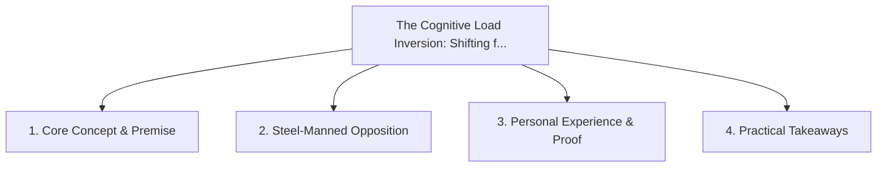

# The Cognitive Load Inversion: Shifting from Framework APIs to Platform Primitives

<!-- prettier-ignore-start -->
<!-- markdownlint-disable MD013 -->
**Series Context**: Part 7 of the [[topics/documents/series-the-zero-dependency-web|The Zero-Dependency & Zero-Framework Web]] series.
<!-- markdownlint-restore -->
<!-- prettier-ignore-end -->

---

## 🗺️ Topic Mind Map

---

## 1. Deep-Dive Knowledge & Context

### Core Insight

Mastering foundational platform primitives has a 20-year half-life; mastering framework lifecycles
expires every 36 months.

### Counter-Perspective (Steel-Manning)

Platform primitives can be lower-level and require more initial line-by-line boilerplate without AI.

### Nuances & Blind Spots

- Practical implementation edge cases when adopting this approach in production environments.
- Distinguishing between dogmatic application and context-sensitive pragmatism.

---

## 2. Evidence, Stories & Reference Vault

### Personal Anecdotes & Field Experience

- Relearning state management 5 times (Flux, Redux, MobX, Recoil, Zustand) only to return to basic
  events.

### Metaphors & Analogies

- **Learning the physics of sailing vs memorizing the dashboard of a rental speedboat.**

---

## 3. Practical Action & Takeaways

1. **First Step**: Audit existing workflows or codebases for this specific failure mode or pattern.
2. **Rule of Thumb**: Prefer explicit, decoupled, and durable implementations over transient
   convenience.
3. **Core Metric**: Reduced maintenance friction, lower cognitive load, and sustained velocity.

---

## 4. Multi-Channel Repurposing Matrix

### Medium / Substack (Focused Deep Dive)

- Narrative arc exploring the problem, field scar tissue, counter-arguments, and solution.

### BlueSky (Micro & Thread Hook)

- **Hook**: "A counter-intuitive lesson from 20+ years of engineering: Mastering foundational
  platform primitives has a 20-year half-life; mastering framework lifecycles expires every 36
  mont... 🧵"

### YouTube / TikTok (Short & Video Vector)

- **Hook**: 60-second walkthrough centered on the metaphor: _Learning the physics of sailing vs
  memorizing the dashboard of a rental speedboat._.
