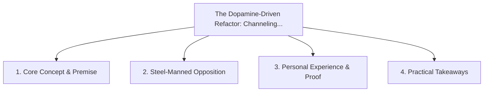

# The Dopamine-Driven Refactor: Channeling ADHD Energy into Clean Codebases

<!-- prettier-ignore-start -->
<!-- markdownlint-disable MD013 -->
**Series Context**: Part 5 of the [[topics/documents/series-neurodiversity-and-systems-thinking|Neurodiversity, ADHD & Systems Thinking in Tech]] series.
<!-- markdownlint-restore -->
<!-- prettier-ignore-end -->

---

## 🗺️ Topic Mind Map

---

## 1. Deep-Dive Knowledge & Context

### Core Insight

Cleaning up tangled code and deleting dead modules provides intense dopamine rewards that can be
channeled into organizational health.

### Counter-Perspective (Steel-Manning)

Refactoring without strict regression test boundaries can introduce unexpected production bugs.

### Nuances & Blind Spots

- Practical implementation edge cases when adopting this approach in production environments.
- Distinguishing between dogmatic application and context-sensitive pragmatism.

---

## 2. Evidence, Stories & Reference Vault

### Personal Anecdotes & Field Experience

- Spending a Friday night happily pruning 2,000 lines of dead code because the visual simplicity
  felt so satisfying.

### Metaphors & Analogies

- **Pressure-washing a weathered deck and watching the clean wood emerge.**

---

## 3. Practical Action & Takeaways

1. **First Step**: Audit existing workflows or codebases for this specific failure mode or pattern.
2. **Rule of Thumb**: Prefer explicit, decoupled, and durable implementations over transient
   convenience.
3. **Core Metric**: Reduced maintenance friction, lower cognitive load, and sustained velocity.

---

## 4. Multi-Channel Repurposing Matrix

### Medium / Substack (Focused Deep Dive)

- Narrative arc exploring the problem, field scar tissue, counter-arguments, and solution.

### BlueSky (Micro & Thread Hook)

- **Hook**: "A counter-intuitive lesson from 20+ years of engineering: Cleaning up tangled code and
  deleting dead modules provides intense dopamine rewards that can be channeled into organiza... 🧵"

### YouTube / TikTok (Short & Video Vector)

- **Hook**: 60-second walkthrough centered on the metaphor: _Pressure-washing a weathered deck and
  watching the clean wood emerge._.
